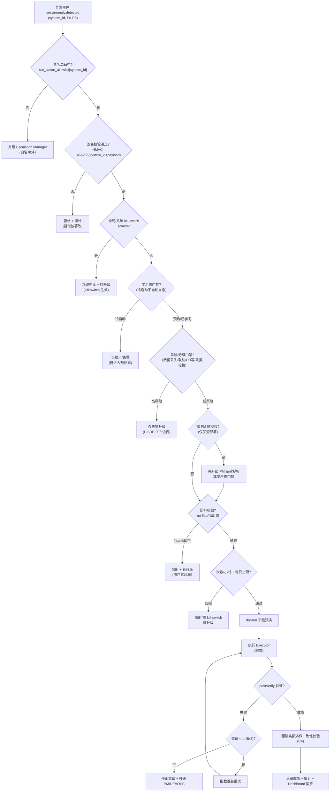
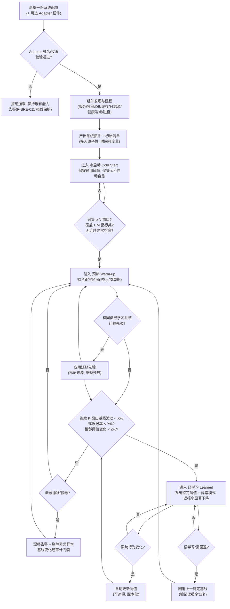
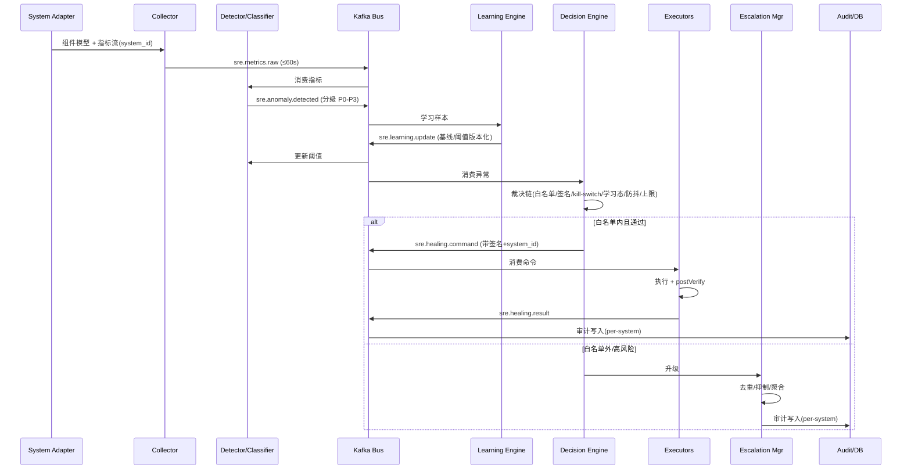

# AI SRE 运维 Agent — 技术架构设计（通用可插拔版）

| 项目 | 内容 |
|------|------|
| 文档编号 | DESIGN-AI-SRE |
| 版本 | v0.2.0 |
| 日期 | 2026-09-05 |
| 关联 Issue | GitHub Issue #370 |
| 上游需求 | FUNCTIONAL-SPEC-AI-SRE v0.3.1（已通过复审，0 Blocking / 0 Major / 0 Minor 残余） |
| 作者 | ARCH（架构 Agent） |
| 状态 | Draft（待 DEV/DEVOPS/CHECKER 评审） |

---

## Changelog

| 版本 | 日期 | 变更说明 |
|------|------|----------|
| v0.2.0 | 2026-09-05 | 架构重构：由「SAS 定制版」升级为「通用可部署、可学习、可支持新系统的 AI SRE」。核心变化：(1) 交付形态改为自包含容器镜像 + compose/helm 编排清单 + 一键接入脚本，配置与代码分离，镜像/代码零 SAS 硬编码（F-SRE-010）；(2) 新增 **System Adapter Layer** 插件层（接口抽象 + 可插拔 + 签名校验 + 热加载/回滚生命周期，F-SRE-011）；(3) 新增 **Learning Engine** 自学习引擎（冷启动→预热→已学习三态迁移，量化参数对齐 AC-012，F-SRE-012）；(4) 新增 **Multi-System Registry** 多系统命名空间隔离（F-SRE-013）；(5) Collector/Detector/Localizer/Healing/Executors/Escalation/Audit 全部泛化为「被纳管系统」表述，SAS 端口/容器数/路径移入「附录：参考实例配置」。保留 C1-C6 已落位安全设计并泛化 |
| v0.1.0 | 2026-09-05 | 初稿：基于 FUNCTIONAL-SPEC-AI-SRE v0.2.0，SAS 定制版总体架构、组件分解、数据流、自愈安全边界、Agent 生态集成、持久化草案、架构图与 ADR |

---

## 1. 概述与设计目标

### 1.1 定位

AI SRE 是一个**通用、可部署、可学习、可支持新系统**的常驻旁路运维 Agent。它以自包含可部署单元交付，通过配置驱动与适配器插件模型接入任意被纳管系统，并对每个接入系统独立进行行为学习与基线建模，实现「接入即用、越用越准」，对低风险可回滚故障执行受限自愈、对超出边界或高风险的故障告警升级。

**School Admin System（SAS）是 AI SRE 的第一个参考部署实例（reference deployment），而非唯一目标系统**：SAS 仅以一份默认示例配置 profile 随发行附带，可删除/替换，不享有任何硬编码特权。本架构所有组件均以「被纳管系统」通用表述，SAS 的拓扑/端口/路径/组件构成全部经配置/适配器注入。

三大核心能力定位（承自需求 §1）：

1. **可部署（Deployable，F-SRE-010）**：自包含镜像 + 编排清单 + 一键接入脚本交付，任意空环境凭最小配置即可启动并进入「待接入」状态。
2. **可学习（Can Learn，F-SRE-012）**：对新系统从冷启动逐步学习基线指标与异常模式，检测阈值与自愈策略随系统行为动态调整。
3. **可支持新系统（Support New System，F-SRE-011/013）**：接入新系统不改核心代码，只加配置或适配器；单实例可同时纳管多个系统，租户强隔离。

核心设计原则（承自 NFR）：

1. **旁路不侵入**：监控采集对主链路零侵入（< 1% CPU 额外负载），自愈动作全部经门禁且可观测、可追溯。
2. **最小权限 + 白名单 + 签名**：自愈能力是「受限能力」而非「全能 root」，动作白名单带显式授权与签名校验，受全局 kill-switch 与每日上限约束。
3. **可回滚、幂等、可观测**：每个自愈动作幂等、执行前留快照、执行后可回滚，审计日志完整、按系统隔离。
4. **配置驱动、插件可插拔**：系统差异全部配置/适配器注入，核心代码与镜像无任何系统特定硬编码。
5. **复用优先**：在 SAS 参考实例中复用现有监控/事件/审计基础设施；通用交付形态不依赖任何单一系统既有栈。

### 1.2 需求覆盖索引（F-SRE-010~013 落位速览）

| 需求 | 架构落位 |
|------|----------|
| **F-SRE-010 可部署性** | §2.1 交付形态（镜像+compose/helm+bootstrap）；§2.2 配置与代码分离；§9 ADR-004 可移植部署选型 |
| **F-SRE-011 系统接入适配器** | §3.1 System Adapter Layer（接口抽象/插件生命周期/签名校验/热加载回滚）；§9 ADR-005 适配器插件模型选型 |
| **F-SRE-012 自学习** | §3.2 Learning Engine（三态迁移量化参数对齐 AC-012、迁移先验、投毒/漂移防护）；§7.4 学习状态/基线存储；§9 ADR-006 自学习引擎选型 |
| **F-SRE-013 多系统/多租户** | §3.3 Multi-System Registry（per-system namespace 隔离）；§5.6 横向越权/凭证泄露遏制；§7.2 per-system 表草案；§9 ADR-007 多租户隔离方案 |

> 既有 C1-C6 安全设计（白名单+签名、AC 可测、防抖、回滚一致性、Redis 数据损坏判据、升级去重/自身运维归属）全部保留并泛化，见 §5。

---

## 2. 总体架构

### 2.1 交付形态与运行时选型（F-SRE-010）

AI SRE 以**自包含可部署单元**交付，三者缺一不可：

| 交付物 | 说明 |
|--------|------|
| **容器镜像 `ai-sre`**（带版本 + 签名） | 核心运行时本体；**不含任何系统特定硬编码**（含 SAS），跨环境复用同一镜像 |
| **编排清单**（docker-compose / helm chart 任一或两者） | 声明 AI SRE 服务的运行拓扑、资源配额、存储卷、Secret 挂载 |
| **一键接入脚本**（bootstrap/onboard） | 空环境解包后执行即启动并进入「待接入」状态，含镜像签名校验、最小配置装载、自检与就绪上报 |

**运行时选型结论**（承自 v0.1.0 ADR-001，泛化）：

- **核心运行时 = 独立常驻服务 `ai-sre-service`**（容器进程，规则+策略引擎驱动，7x24 低延迟，不依赖 LLM 即可完成采集/检测/分级/受限自愈）。
- **协作层 = 复用现有 Agent 生态**（write_message.py / agent-status / GitHub label / Dashboard / PM 调度），AI SRE 注册为 Agent 角色。
- **深度推理 = 按需云端 LLM**（复杂根因定位、告警文案生成走 OpenClaw gateway 云端模型，符合 HYBRID-ARCHITECTURE「本地流程编排 + 云端深度推理」分层）。

### 2.2 配置与代码分离（F-SRE-010 / NFR-X）

- **运行所需的一切差异**（目标系统地址/端口/路径、凭据引用、阈值、策略、告警通道）均通过配置文件 / 环境变量 / Secret 注入。
- 核心代码与镜像**不含任何系统特定硬编码**；SAS 仅以一份默认示例配置 profile（`profiles/sas.yaml`）随发行附带，可删除/替换。
- **凭配置即运行**：空环境仅提供最小配置即可启动并进入「待接入」状态（最小配置集合见 §2.4）。
- 自愈策略、白名单、阈值等策略同样配置化，版本化存储（§7）。

### 2.3 与「被纳管系统」的拓扑关系（泛化）

```
                          ┌───────────────────────────────────────────────┐
                          │            用户 / 外部访问 (Coze proxy)        │
                          └───────────────┬───────────────────────────────┘
                                          │ :5001 gateway / cloudflared
        ┌─────────────────────────────────┼───────────────────────────────┐
        │      被纳管系统（示例 = SAS，经配置/适配器注入）                   │
        │  frontends · backend · db · cache · 日志源 · 磁盘卷              │
        └───────────┬─────────────────────┴──────────────┬────────────────┘
                    │ 健康端点/资源指标/日志（只读）        │
   ┌────────────────▼─────────────────────────────────────▼───────────────┐
   │          System Adapter Layer（适配器插件层，每系统一个 Adapter 实例） │
   │  ServiceDiscovery · HealthProbe · ResourceCollect · LogSource · ...   │
   │  [内置参考] Generic HTTP Adapter · SAS Adapter · Docker Adapter      │
   └───────────────┬─────────────────────────────────────────────────────┐
                   │ 标准化组件模型 + 指标流（每系统独立 namespace）
   ┌───────────────▼─────────────────────────────────────────────────────┐
   │                     AI SRE 独立服务 (ai-sre-service)                  │
   │   Collector → Detector/Classifier → Localizer → Learning Engine       │
   │   → Healing Decision Engine → Executors/Escalation → Audit           │
   │   策略引擎(白名单/签名/熔断) · 多系统 Registry · Dashboard 同步        │
   └───────┬─────────────────────────────┬───────────────────────────────┘
           │ 受限自愈(白名单内)           │ 升级(白名单外/高风险)
           ▼                               ▼
   ┌───────────────┐              ┌─────────────────────────────────────┐
   │ 目标系统服务    │              │ 多 Agent 协作层 (write_message.py)  │
   │ restart/清理等 │              │ PM / DEV / QA / DEVOPS / CHECKER    │
   └───────────────┘              │ / OPS / ARCH / REQ  →  + AI SRE      │
                                  └─────────────────────────────────────┘
```

> 说明：SAS 参考实例中，Adapter 复用其既有 13 容器监控/事件基础设施（Prometheus/Kafka/PostgreSQL/Redis/OPA）作为数据源；但通用交付形态不强制要求目标系统存在这些组件——无适配器时降级为通用 HTTP 探测 + 日志源 + 资源指标最小接入（F-SRE-011 降级路径）。

### 2.4 最小配置集合（Minimal Config）

对齐 AC-010 定义，空环境启动进入「待接入」所需最小配置（不含任何 SAS 特定项）：

```yaml
# minimal config — 凭此即可启动进入「待接入」状态
identity:            # AI SRE 自身身份/监听端口
  instance_id: ai-sre-01
  listen: "0.0.0.0:9090"
secrets:             # 密钥管理引用（非明文）
  signing_key_ref: "vault://ai-sre/signing-key"
alert_channels:      # 告警通道地址
  - type: write_message
    endpoint: "skills/agent-communication/scripts/write_message.py"
systems: []          # 被纳管系统接入配置（可为空 = 待接入态）
```

### 2.5 组件清单

| 组件 | 职责 | 部署形态 | v0.1.0 → v0.2.0 |
|------|------|----------|------------------|
| **System Adapter Layer（系统接入适配器层）** | 组件发现与建模、健康/资源/日志采集接口抽象、插件生命周期管理 | 每系统一个 Adapter 实例，独立进程/沙箱 | 🆕 新增（F-SRE-011） |
| **Learning Engine（自学习引擎）** | 三态迁移、基线拟合、阈值收敛、异常模式学习、迁移先验、投毒/漂移防护 | ai-sre-service 内常驻 | 🆕 新增（F-SRE-012） |
| **Multi-System Registry（多系统注册/命名空间隔离）** | per-system 配置/凭证/策略/审计命名空间管理，横向越权遏制 | ai-sre-service 内常驻 | 🆕 新增（F-SRE-013） |
| **SRE Collector（监控采集）** | 周期采集健康/容器/DB/缓存/磁盘/日志/心跳指标 | 内常驻循环（数据源经 Adapter 抽象） | ♻️ 泛化 |
| **Detector + Classifier（检测/分级）** | 规则+基线检测异常，映射 P0-P3 并给分级理由 | 同上 | ♻️ 泛化 |
| **Localizer（根因定位）** | 产出受影响组件、最近变更关联、根因假设 | 规则定位（本地）+ 复杂场景云端 LLM | ♻️ 泛化 |
| **Healing Decision Engine（自愈决策）** | 白名单/签名/kill-switch/熔断/防抖/SVA 门禁裁决 | 策略引擎（可复用 OPA 或独立策略层） | ♻️ 泛化 |
| **Healing Executors（自愈执行器 ×5）** | restart 容器/清磁盘/回滚/释放资源/重启缓存，含执行后验证 | 独立执行器模块，dry-run 可测 | ♻️ 泛化 |
| **Escalation Manager（告警升级）** | 去重/抑制/聚合，路由 PM/DEVOPS/DEV/QA，创建/关联 Issue | 同上 | ♻️ 泛化 |
| **Audit Logger（审计日志）** | 不可变、按系统隔离的审计记录，CHECKER 质检数据源 | 写 PostgreSQL（per-system 分区） | ♻️ 泛化+隔离 |
| **SRE Dashboard 集成** | agent-status 同步 + 运行状态看板 | 复用 Multi-Agent Dashboard + Grafana | 保留 |
| **LLM Adapter（深度推理）** | 复杂根因定位/告警文案按需云端 | gateway 云端模型调用 | 保留 |

---

## 3. 组件分解

### 3.1 System Adapter Layer（系统接入适配器层，F-SRE-011）

**新增组件**。负责对被纳管系统的组件发现与建模，将系统差异封装在插件层，使核心代码零系统硬编码。

#### 3.1.1 接口抽象

```
interface SystemAdapter {
  // 身份与能力声明
  systemId(): string;
  capabilities(): AdapterCapability[];          // 声明支持发现/采集的组件类别
  minPrivilege(): PermissionDeclaration[];      // 最小权限声明（供沙箱校验）

  // 组件发现与建模
  discover(ctx): ComponentModel[];              // 服务/容器/DB/缓存/日志源/健康端点/磁盘
  model(): SystemTopology;                       // 归一化拓扑（组件→指标映射）

  // 采集（只读）
  collectHealth(ctx): HealthSample[];            // 健康端点探测
  collectResources(ctx): ResourceSample[];       // CPU/内存/磁盘/容器状态
  collectLogs(ctx): LogEvent[];                  // 日志源 ERROR/FATAL/panic
  collectDb(ctx): DbSample[];                    // 只读 DB 连接/慢查询/连接池
  collectCache(ctx): CacheSample[];              // 缓存内存/命中率/连接
}
```

组件发现与建模产出类别（能力取决于加载的适配器）：服务/容器、数据库、缓存/键值存储、日志源、健康端点、磁盘/资源。

#### 3.1.2 插件生命周期与安全（F-SRE-011 / M1）

| 生命周期阶段 | 机制 |
|--------------|------|
| **注册** | 新增系统 = 一份配置 +（可选）一个 Adapter 插件，不改核心代码 |
| **签名校验** | Adapter 包带签名（HMAC/证书），加载前验签；验签失败拒绝加载 |
| **最小权限声明** | Adapter 声明所需权限，与沙箱策略比对，超出声明即拒绝 |
| **沙箱隔离** | Adapter 运行于独立进程/沙箱，与核心服务内存/网络隔离，故障不污染其他系统 |
| **热加载** | 支持运行中热加载新 Adapter（不中断已纳管系统） |
| **回滚** | Adapter 升级失败可回滚到上一签名版本；加载/校验失败时拒绝加载并保持既有能力可用 |
| **拒载保护** | 任一缺陷/恶意 Adapter 不得攻陷或污染 AI SRE 实例及其纳管的其它系统 |

#### 3.1.3 内置参考适配器与降级路径

- **Generic HTTP Adapter（内置）**：对未提供专用适配器的系统，经通用 HTTP 健康探测 + 日志源 + 资源指标的最小接入（F-SRE-011 降级）。
- **SAS Adapter（内置参考）**：封装 SAS 的 13 容器/PostgreSQL/Redis/多前端入口的具体发现与采集逻辑，作为「如何写一个专用 Adapter」的参考实现与首个参考实例的默认接入方式。
- **Docker Adapter（内置）**：通用 Docker daemon 发现/采集（容器状态/资源/事件流），可复用于任何 Docker 化系统。

> SAS 的具体端口/容器数/路径**只出现在 SAS Adapter 与 SAS profile 内**，不出现在核心代码/镜像。

### 3.2 Learning Engine（自学习引擎，F-SRE-012）

**新增组件**。对每个接入系统独立进行基线学习与异常模式建模，阈值与自愈策略随系统行为动态调整。

#### 3.2.1 学习三态状态机（每系统独立）

```
  ┌──────────────┐  首轮发现+监控建立完成   ┌──────────────┐  收敛判据满足   ┌──────────────┐
  │  Cold Start  │ ──────────────────────► │   Warm-up    │ ──────────────► │   Learned    │
  │  冷启动       │                          │   预热       │                  │  已学习      │
  └──────────────┘                          └──────────────┘                  └──────────────┘
   保守通用阈值                                拟合正常区间(时/日/周周期、       系统特定阈值+异常模式，
   异常判定偏「提示」                           负载范围、延迟分布)               误报率显著下降
   不自动自愈                                                                  自动自愈按学习后策略
```

**三态迁移量化参数（对齐 AC-012，默认值可配置）**：

| 迁移 | 判据 | 量化参数 |
|------|------|----------|
| 冷启动 → 预热 | 完成首轮组件发现与监控建立后进入预热，持续采集 ≥ N 个观测窗口，覆盖指标类别 ≥ M 类，且无连续异常空窗 | **N=7**（完整日窗口或等量小时窗口）；**M=4**（服务健康/资源/日志/缓存或数据库） |
| 预热 → 已学习 | 最近连续 K 个观测窗口内基线波动 < X%（按指标类型分别度量）或误报率 < Y%，且相邻窗口阈值变化 < Z% 视为收敛 | **K=14**；**X=20%**；**Y=5%**；**Z=5%** |
| 跨系统迁移先验 | 达「已学习」所需观测窗口数较无先验冷启动减少 ≥ 25%，或冷启动→已学习总时长缩短 ≥ 25% | 迁移先验标记来源，QA 以同构样本对照验证 |

#### 3.2.2 学习功能模块

- **基线拟合**：对每指标拟合正常区间（均值/方差/时-日-周周期、负载范围、延迟分布）。
- **阈值收敛**：检测阈值随基线演化自动更新（如流量增长后正常 CPU 区间上移），更新可追溯。
- **异常模式学习**：学习异常指纹/告警模板，供 Detector 规则通道复用。
- **迁移先验库（Transfer Priors）**：从已学习系统提取同类技术栈先验（通用异常模式、告警模板），迁移到新系统缩短冷启动/预热；迁移前标记来源，避免过拟合异质系统。
- **投毒/漂移防护**：学习期剔除异常样本（被攻陷/故障系统的异常数据不参与拟合）；检测概念漂移并告警；基线重大变化经可解释审计与门禁（默认需人工确认）。
- **版本化与回退**：学习结果（阈值/规则/策略）版本化，支持回退到上一稳定基线（误学习可回退）。

#### 3.2.3 冷启动期安全姿态

冷启动态采用保守通用阈值，异常判定偏向「提示而非自动自愈」——即冷启动态仅告警/提示，不触发自动自愈；进入预热态后才逐步放开受限自愈，进入已学习态后按系统特定阈值执行完整自愈策略。

### 3.3 Multi-System Registry（多系统注册与命名空间隔离，F-SRE-013）

**新增组件**。管理多系统纳管与租户隔离：

- **系统注册**：维护 `sre_systems` 注册表（system_id 为主键），每个系统独立建模/监控/告警/学习（状态机互不干扰）。
- **命名空间隔离**：每系统一个 namespace，配置、凭证（Secret 引用）、自愈策略、告警通道、审计日志、学习状态**全部按 system_id 隔离**。
- **凭证命名空间/密钥隔离**：每系统凭证以独立 namespace 注入，系统 A 的凭证/令牌不得访问系统 B 资源；跨租户访问一律拒绝并告警（AC-013a）。
- **审计边界**：审计日志按系统隔离存储、仅追加写；被攻陷系统不得篡改/删除他系统审计，越权写审计触发告警（F-SRE-013）。
- **配额与横向扩展**：单实例纳管系统数可配，超阈值可多实例水平扩展分工纳管（NFR-X）。

### 3.4 SRE Collector（监控采集，泛化）

对应 F-SRE-001。采集源统一经 System Adapter Layer 抽象，核心不再直接感知具体系统：

| 采集项 | 数据源 | 采集方式（经 Adapter 抽象） |
|--------|--------|------------------------------|
| 服务健康 | 配置的健康端点 | HTTP 探针（状态码/时延/body） |
| 前端/入口可用性 | 配置的前端入口 | HTTP 探针 + 关键页面渲染 |
| 容器/进程 | 容器运行时（Docker 等） | 经 Docker Adapter：stats/事件流 |
| 数据库 | 被纳管系统数据库 | 只读连接（无写权限） |
| 缓存/键值存储 | 被纳管系统缓存 | 只读探测 |
| 磁盘/资源 | 宿主/数据卷 | CPU/内存/磁盘使用率、日志增长 |
| 日志 | 聚合日志源 | 订阅 ERROR/FATAL/panic |
| 心跳 | Agent 心跳 | 心跳文件/agent-status |

采集节奏：关键健康检查 ≤ 60s，全量巡检 ≤ 5min（NFR-A）。采集器为无状态、可水平扩展的 worker 池，按 system_id 分片，结果写入事件总线（带 system_id 命名空间标记）。

### 3.5 Detector + Classifier（检测与分级，泛化）

对应 F-SRE-002/003。**规则 + 基线**双通道：

- **规则通道**：硬阈值（磁盘 85%=P2、95%/写满=P0；连接池 >80% 告警等）、状态机（健康检查连续 N 次失败 → P0）。阈值经 Learning Engine 按系统动态调整。
- **基线通道**：对比历史基线检测突变（错误率/5xx 比例升高、慢查询突增、内存持续高位）。基线来自 Learning Engine。

分级器输出 `{system_id, severity P0-P3, 分级理由, 受影响组件, 指标值, 检测时间}`。

### 3.6 根因定位（Localizer，泛化）

对应 F-SRE-004。分层定位：

1. **确定性定位（本地规则）**：容器 OOM 退出、磁盘写满、端口无响应、依赖不可达 → 匹配已知模式，产出根因假设与置信度。
2. **变更关联**：关联最近部署 commit、配置变更（读取部署快照表/变更日志）。
3. **深度定位（云端 LLM）**：低置信度/复杂堆栈 → 经 LLM Adapter 调云端模型，产出根因假设 + 建议处理动作。

输出 `{system_id, affected_component, recent_changes[], root_cause_hypothesis[], confidence, suggested_action}`。

### 3.7 Healing Decision Engine（自愈决策引擎）

对应 F-SRE-005/006/007 + C1/C3。**自愈执行的唯一裁决入口**，串行执行裁决链（任一不通过即转升级）：

```
裁决链：白名单命中(per-system) → 签名校验 → 全局 kill-switch 通过 → 分级/风险门禁
       → 学习态门禁(冷启动不自动自愈) → 防抖(no-flap/冷却/次数上限)
       → 每日/小时熔断上限 → SVA 门禁映射 → 干跑(dry-run)预演 → 执行 → 执行后验证
```

### 3.8 Healing Executors（自愈执行器 ×5，泛化）

对应 F-SRE-005 + C2。每类动作独立 Executor，统一契约：

```
interface Executor {
  actionType: 'container_restart' | 'disk_cleanup' | 'deploy_rollback'
            | 'resource_release' | 'cache_restart';
  preCheck(ctx): boolean;        // 前置条件校验（白名单/信号确认）
  dryRun(ctx): Plan;             // 干跑预演（可测性）
  execute(ctx): Result;          // 幂等执行
  postVerify(ctx): VerifyResult; // 执行后验证（健康/一致性）
}
```

> 动作名由 `redis_restart` 泛化为 `cache_restart`（覆盖任意缓存/键值存储，Redis 仅为 SAS 实例取值）。

| Executor | 允许自动执行条件（摘要，详见 §5 判定矩阵） | 执行后验证 |
|----------|--------------------------------------|-----------|
| container_restart | 无状态服务；二次独立信号确认；冷却期内无重复 | 健康检查恢复 |
| disk_cleanup | 85%≤使用率<95%；仅白名单临时文件/旧日志/孤儿镜像卷 | 磁盘使用率回落 + 受保护卷未动 |
| deploy_rollback | 同时满足 (a)上一稳定版本曾通过 QA 且健康 (b)变更窗内 (c)PM 软授权或严格门禁 | **Post-rollback 一致性校验（C4）** + 健康恢复 |
| resource_release | 僵尸进程/无状态连接池；无在途写；非联动故障 | 资源释放 + 服务健康 |
| cache_restart | 仅缓存/会话；确认非持久队列源；非数据损坏 | ping 恢复 + 数据损坏复核 |

**C2 落位**：五类 Executor 各自独立实现 + 独立 dry-run + 独立指标（`sre_healing_{actionType}_success/failure/latency`，带 system_id label），QA 可对每类单独注入故障逐类验收（AC-005a~d）。

### 3.9 Escalation Manager（告警升级）

对应 F-SRE-007 + C6。职责：

- **去重**：按异常指纹 `hash(system_id + anomaly_type + affected_component + 时间桶)` 去重。
- **抑制**：维护窗口/已知故障静默期内抑制。
- **聚合/收敛**：按 P0/P1 收敛通知（同一根因多次告警合并为 1 条升级），防告警疲劳与重复 Issue。
- **路由**：PM（P0/P1/需决策）、DEVOPS（部署/回滚/基础设施）、DEV（明确代码缺陷→创建 Issue）、QA（自愈后验证请求）。
- **可靠性**：升级链路失败 → 落盘持久化重试（Kafka 消费重试 + 保底落地 Issue）。

### 3.10 Audit Logger（审计日志）

对应 NFR-S/F-SRE-013 审计边界。不可变、**按 system_id 命名空间隔离**、仅追加写，是 CHECKER 质检的输入。写入失败则**阻止后续自愈**（fail-closed，UC-010）。越权写审计（跨 system_id）触发告警。

---

## 4. 数据流与事件通道

### 4.1 事件通道选型

**结论：复用现有 Kafka 作为主事件总线；Redis Streams 作为轻量降级备选**（SAS 参考实例中复用其 kafka 容器；通用交付形态内嵌一个轻量事件总线实现，可配置替换为外部 Kafka）。该取舍见 **ADR-002**。

Kafka Topic 规划（每个消息体带 `system_id` 命名空间标记）：

| Topic | 生产者 | 消费者 | 语义 |
|-------|--------|--------|------|
| `sre.metrics.raw` | Collector（经 Adapter） | Detector | 原始采集快照（含 system_id） |
| `sre.anomaly.detected` | Detector | Localizer / Decision Engine / Learning Engine | 已分级异常事件（含 system_id） |
| `sre.learning.update` | Learning Engine | Detector / Decision Engine | 基线/阈值/策略更新事件（版本化） |
| `sre.healing.command` | Decision Engine | Executors | 已裁决的自愈命令（含签名 + system_id） |
| `sre.healing.result` | Executors | Decision Engine / Audit | 执行结果（含验证） |
| `sre.escalation.request` | Escalation Manager | 外部协作层 | 升级请求（去重后） |

### 4.2 完整数据流链路

```
  [被纳管系统监控数据] ──► [Adapter 发现/采集] ──► [检测] ──► [分级] ──► [学习] ──► [自愈/升级] ──► [审计]
        │                      │                   │          │          │           │               │
    (配置注入)          System Adapter Layer     Detector  Classifier Learning   Decision      Audit Logger
        │               (每系统一个实例)          (规则+基线) (P0-P3)   Engine    Engine        (不可变)
        │                      │                   │          │          │       (白名单+签名+    按 system_id
        │                      ▼                   ▼          ▼          ▼        熔断+防抖+门禁) 隔离
        │               sre.metrics.raw     sre.anomaly.detected  sre.learning.update  sre.healing.command ──► PostgreSQL
        │               (Kafka, 带system_id)   (Kafka)              (Kafka)             sre.healing.result
        │                                                        (基线/阈值版本化)          (Kafka)
        │                                                                                    │
        │                                                                    ┌──────────────┴───────────────┐
        │                                                                    ▼                              ▼
        │                                                          [白名单内+通过]               [白名单外/高风险]
        │                                                                    │                              │
        │                                                              Executors                    Escalation Manager
        │                                                             (5类+验证)                     (去重/抑制/聚合)
        │                                                                    │                              │
        │                                                                    ▼                              ▼
        │                                                           自愈成功记录                     升级 PM/DEVOPS/DEV/QA
        │                                                                    │                    (write_message + Issue)
        │                                                          postVerify 失败→转升级
```

---

## 5. 自愈执行安全边界

> 本章保留并泛化 v0.1.0 对 **C1（安全）、C3（防抖）、C4（回滚）、C5（判据）** 的落位，并与 SVA gate 对齐。

### 5.1 动作白名单 + 签名校验（C1）

- **白名单**：可自动执行动作维护在版本化、**per-system** 策略表 `sre_action_allowlist`（§7.2），每条含：`system_id / action_type / target_pattern / allowed / 前置条件 / daily_limit / hourly_limit / cooldown_seconds / requires_signature / requires_pm_auth / schema_version`。
- **签名**：自愈命令由 Decision Engine 签发，携带 `HMAC-SHA256(system_id + action_payload, sre_signing_key)` 签名；Executor 验签通过才执行。签名密钥与业务凭据分离，经密钥管理获取，不落盘明文。
- **凭证分离**：AI SRE 运行账户为独立受限账户（非 root），仅持监控只读 + 白名单内动作所需最小权限，**不持有被纳管系统数据库写权限、不访问 PII**。多系统场景下，每系统凭证独立命名空间注入。

### 5.2 与 SVA gate 的关系

AI SRE 的自愈动作属新增 Action Class `SRE_HEAL`：

| 自愈动作 | SVA 门禁 | 说明 |
|----------|----------|------|
| 重启容器（无状态） | 免门禁（白名单+签名+限流自动放行） | 低风险可回滚 |
| 清理磁盘（白名单内） | 免门禁 | 仅白名单临时文件/旧日志 |
| 连接池重建/释放资源 | 免门禁 | 仅无在途写且确认非联动 |
| 重启缓存（仅缓存/会话、非损坏） | 免门禁 | 受数据损坏检测硬约束 |
| **回滚部署** | **需 PM 软授权**（或严格门禁） | 触及发布/变更窗治理 |

> 所有「免门禁」动作仍必须通过 §5.1 白名单+签名+§5.3 kill-switch+§5.4 熔断/防抖+§3.2 学习态门禁；「免门禁」仅指**不需人工逐次审批**，非「无任何控制」。

### 5.3 全局紧急 kill-switch（C1）

- 单一全局熔断开关：`sre:kill_switch`（Redis flag，值 `armed`/`disarmed`），同时落盘备份到 PostgreSQL 审计记录。多系统部署下支持全局 + per-system 两级 kill-switch。
- 任一人（PM/CHECKER/人类）可一键置 `armed`；置位后：**所有自愈动作（含已在队列中的命令）立即中止**，Executor 拒绝执行并转升级。
- 自愈风暴、安全事件、大促/变更冻结期等场景强制置位。恢复需人工显式 `disarmed` 并记录审计。

### 5.4 熔断/退避/每日上限（C1/C3）

三层限流，全部在 Decision Engine 内以 Redis 计数器实现（默认值可配，按 system_id 维度独立计数）：

| 维度 | 默认值 | 超限动作 |
|------|--------|----------|
| 单服务自愈次数/小时 | 5 次/小时 | 熔断该服务，转升级 DEVOPS |
| 单系统自愈次数/日 | 可配 | 熔断该系统，转升级 PM |
| 全局自愈次数/日 | 50 次/日 | 全局熔断，置 kill-switch，转升级 PM |
| 单动作冷却期 | restart 10min / 回滚 30min / 清盘 60min | 冷却期内拒绝重复 |

**防抖（no-flap）**：同一异常指纹（含 system_id）在时间窗内反复「恢复→再告警」达 N 次（默认 3 次/30min）→ 判定 flap，停止自愈并转升级人工研判。

**退避**：自愈失败重试采用指数退避（1→2→4min），达上限（默认 3 次）停止重试转升级（UC-008）。

### 5.5 回滚后一致性校验（C4）

回滚执行器 `postVerify` 强制包含 **Post-rollback Consistency Verifier**：

1. **配置一致性**：对比版本快照的 env/config hash，检测配置漂移。
2. **依赖一致性**：依赖服务健康、DB migration 版本匹配、缓存 key schema 兼容。
3. **版本一致性**：确认回滚目标命中「最近一次 QA 签收通过」的版本集（快照含 QA 签收标记）。

任一校验失败 → 立即升级 DEVOPS，标注**紧急**，不自动二次回滚。

### 5.6 缓存「数据损坏」具体判据（C5，泛化）

`cache_restart` Executor 前置必须通过 Cache Data Corruption Detector，出现**任一**信号即判定「数据损坏」，**禁止重启**，转升级 DEVOPS：

1. 持久化文件（RDB/AOF 等）加载失败，或 `last_bgsave_status=err` / `last_write_status=err`。
2. 持久化文件校验工具（如 `redis-check-rdb`/`redis-check-aof`）校验失败。
3. 关键 key 类型不匹配（对预期类型做抽样）。
4. 持久队列数据源 key 的应用层 CRC/签名校验失败。
5. 主从复制 offset 持续倒退/不一致且无法自愈。

**「非损坏可重启」安全边界**（同时满足才可重启）：缓存仅作缓存/会话（配置白名单 key 前缀 + 无持久队列 key 前缀）且 `last_bgsave_status=ok` 且无上述 5 类信号。

### 5.7 横向越权与凭证泄露遏制（F-SRE-013 / AC-013a）

- 所有内部调用携带 `system_id`，Registry 层强制校验调用方命名空间，跨 system_id 访问一律拒绝并触发安全告警。
- 每系统凭证以独立 Secret namespace 注入，运行时内存按 system_id 隔离；系统 A 的凭证/令牌不得访问系统 B 资源。
- 任一系统被攻陷仅影响其自身 namespace，不越权影响他系统监控/自愈/审计。

---

## 6. 与现有 Agent 生态集成（C6/F-SRE-009）

### 6.1 注册清单（落地项）

AI SRE（及 OPS）需注册进以下位置（现有枚举为 `{PM,DEV,QA,DEVOPS,CHECKER,ARCH,REQ}`）：

| 位置 | 现状 | 需变更 |
|------|------|--------|
| `skills/agent-communication/scripts/write_message.py` | `GITHUB_AGENT_LABELS` + `--from` choices 无 AI SRE | 新增 `"AI-SRE": "ai-sre"`（含 label 映射与 `--from` 枚举） |
| `agent-status.json` | 无 AI SRE | 由 write_message 自动写入 |
| GitHub label | 无 `ai-sre` | 新增 label `ai-sre` |
| Dashboard 面板 | 无 AI SRE | update_dashboard 渲染新角色卡 |
| `docs/SVA-GATE.md` | 无 AI SRE 角色 | 新增 AI SRE Role-Action 矩阵（含 `SRE_HEAL` 动作类） |

> ARCH 只输出**变更清单**，具体枚举/标签/面板落地由 DEVOPS/PM 在实施阶段执行。

### 6.2 多系统下的实例注册与区分

单实例同时纳管多个系统时，Agent 生态层只注册**一个 AI SRE Agent 身份**（`AI-SRE`），被纳管系统的区分在内部通过 `system_id` namespace 完成，不外泄为多个 Agent 角色：

- **通信层**：AI SRE 作为单一 Agent 通过 write_message.py 收发消息；升级消息体带 `system_id` 标记，便于 PM/DEVOPS 区分「哪个系统」出问题。
- **Issue 层**：跨系统事件各自创建/关联 Issue，Issue 标题/正文带系统标识（如 `[SAS]` 前缀）。
- **Dashboard**：AI SRE 卡片展示纳管系统数与各系统学习态（cold/warm/learned）、自愈计数、告警计数汇总。
- **水平扩展**：多实例部署时，每实例一个独立 AI SRE Agent 身份（如 `AI-SRE-01`/`AI-SRE-02`），各自分工纳管不同系统集，经 Registry 分片。

### 6.3 心跳与自身可用性兜底

- AI SRE 每 5min 写一次自身心跳（复用 agent-status.json）。
- **PM watchdog 兜底**：PM 侧检测 AI SRE 心跳超时 → 告警（UC-009）。
- **对等健康对账**：OPS 基础巡检作为 AI SRE 的独立第二观察者，交叉核对 AI SRE 是否在线，形成「PM watchdog + OPS 对等对账」双兜底。

### 6.4 AI SRE 自身运维归属（C6-m7）

| 事项 | 归属 |
|------|------|
| AI SRE 运行时部署/升级/回滚 | **DEVOPS**（超出 AI SRE 自愈权限，自身不回滚自己） |
| AI SRE 代码/配置变更 review | **PM 审批 + CHECKER 质检** |
| 自愈策略/白名单变更 | **PM 软授权**，变更走审计 |
| AI SRE 自身故障修复 | 心跳兜底检测 → **DEVOPS** |
| 纯运营值班/巡检 | **OPS**（与 DEVOPS 命名区分） |

---

## 7. 持久化与状态

### 7.1 存储选型

- **状态/历史/审计/学习 → PostgreSQL**（新增 `sre_*` 表，全部带 `system_id` 命名空间）。
- **限流/熔断/防抖计数器 → Redis**（高频、短生命周期，无需持久化，宕机可重置）。
- **事件流 → Kafka**（§4 主题，retention 72h）。

### 7.2 多系统命名空间表草案

> 命名遵循 DB-SCHEMA §2 命名规范（snake_case，TIMESTAMPTZ，ENUM）。所有业务表带 `system_id` 外键实现 per-system 隔离；审计事件复用既有 `audit_logs`（扩展 `audit_action` 枚举 + `system_id` 列）。

**表 0：`sre_systems` — 系统注册表（F-SRE-013 多系统纳管）**

| 字段 | 类型 | 说明 |
|------|------|------|
| system_id | UUID PK | 系统唯一标识 |
| name | VARCHAR(64) | 系统名（如 school-admin-system） |
| adapter_id | UUID FK→sre_adapters | 绑定的适配器 |
| profile_ref | VARCHAR(128) | 配置 profile 引用 |
| credential_ns | VARCHAR(64) | 凭证命名空间（Secret 引用） |
| learning_state | sre_learning_state_enum | cold_start/warm_up/learned |
| status | sre_system_status_enum | onboarding/active/degraded/offboarded |
| onboarded_at | TIMESTAMPTZ | 接入时间 |

**表 1：`sre_incidents` — 异常事件（检测/分级/定位真相源）**

| 字段 | 类型 | 说明 |
|------|------|------|
| id | UUID PK | 事件主键 |
| system_id | UUID FK→sre_systems | **命名空间隔离** |
| anomaly_type | VARCHAR(64) | service_down/disk_high/db_error/cache_error/... |
| severity | sre_severity_enum | P0/P1/P2/P3 |
| status | sre_incident_status_enum | detected/locating/healing/escalated/resolved/suppressed |
| affected_component | VARCHAR(128) | 受影响组件/容器/服务 |
| root_cause_hypotheses | JSONB | 根因假设数组（含置信度） |
| recent_changes | JSONB | 最近部署 commit/配置变更关联 |
| dedup_fingerprint | VARCHAR(64) | 去重指纹 hash（含 system_id） |
| detected_at / resolved_at | TIMESTAMPTZ | 检测/解决时间 |

**表 2：`sre_healing_actions` — 自愈动作执行记录（C1/C2 审计核心）**

| 字段 | 类型 | 说明 |
|------|------|------|
| id | UUID PK | 动作主键 |
| system_id | UUID FK→sre_systems | **命名空间隔离** |
| incident_id | UUID FK→sre_incidents | 关联事件 |
| action_type | sre_action_enum | container_restart/disk_cleanup/deploy_rollback/resource_release/cache_restart |
| target | VARCHAR(128) | 目标（容器/卷/服务名） |
| policy_version | VARCHAR(32) | 白名单策略版本 |
| signature | VARCHAR(128) | HMAC 签名（验签留痕） |
| dry_run_result | JSONB | 干跑计划 |
| result | sre_action_result_enum | success/failed/skipped/killswitched/escalated |
| post_verify_result | JSONB | 执行后验证（含 C4 一致性校验） |
| retry_count | SMALLINT | 重试次数 |
| started_at / finished_at | TIMESTAMPTZ | 起止时间 |

**表 3：`sre_escalations` — 升级记录（C6 去重/抑制留痕）**

| 字段 | 类型 | 说明 |
|------|------|------|
| id | UUID PK | 升级主键 |
| system_id | UUID FK→sre_systems | **命名空间隔离** |
| incident_id | UUID FK→sre_incidents | 关联事件 |
| target_agent | VARCHAR(16) | PM/DEVOPS/DEV/QA |
| channel | VARCHAR(32) | write_message / Issue / 其他 |
| issue_id | INTEGER | 关联 GitHub Issue |
| dedup_fingerprint | VARCHAR(64) | 去重/抑制指纹 |
| status | sre_escalation_status_enum | pending/sent/acked/failed |
| sent_at / ack_at | TIMESTAMPTZ | 发送/确认时间 |

**表 4：`sre_action_allowlist` — 自愈白名单与策略（per-system 版本化）**

| 字段 | 类型 | 说明 |
|------|------|------|
| id | UUID PK | 策略主键 |
| system_id | UUID FK→sre_systems | **per-system 策略隔离** |
| action_type | sre_action_enum | 动作类型 |
| target_pattern | VARCHAR(128) | 目标匹配模式 |
| allowed | BOOLEAN | 是否允许自动执行 |
| preconditions | JSONB | 前置条件 |
| daily_limit / hourly_limit | SMALLINT | 每日/小时上限（C1/C3） |
| cooldown_seconds | INTEGER | 冷却期 |
| requires_signature | BOOLEAN | 是否需签名 |
| requires_pm_auth | BOOLEAN | 是否需 PM 软授权（回滚=true） |
| schema_version | VARCHAR(32) | 策略版本 |
| updated_by / updated_at | VARCHAR(16)/TIMESTAMPTZ | 变更审计 |

### 7.3 适配器注册表草案

**表 5：`sre_adapters` — 适配器插件注册（F-SRE-011 生命周期）**

| 字段 | 类型 | 说明 |
|------|------|------|
| id | UUID PK | 适配器主键 |
| adapter_type | VARCHAR(64) | generic_http/sas/docker/... |
| version | VARCHAR(32) | 插件版本 |
| signature | VARCHAR(128) | 插件签名（验签留痕） |
| permission_decl | JSONB | 最小权限声明 |
| status | sre_adapter_status_enum | active/rolling_back/rejected/disabled |
| loaded_at / rolled_back_at | TIMESTAMPTZ | 热加载/回滚时间 |

### 7.4 学习状态与基线存储草案（F-SRE-012）

**表 6：`sre_learning_state` — 每系统学习三态状态机**

| 字段 | 类型 | 说明 |
|------|------|------|
| system_id | UUID PK/FK→sre_systems | 每系统一行 |
| state | sre_learning_state_enum | cold_start/warm_up/learned |
| observation_windows | INTEGER | 已采集观测窗口数（对照 N） |
| metric_coverage | SMALLINT | 已覆盖指标类别数（对照 M） |
| consecutive_clean | INTEGER | 连续无异常空窗数 |
| last_transition_at | TIMESTAMPTZ | 上次迁移时间 |
| transfer_prior_used | BOOLEAN | 是否使用迁移先验 |
| transition_params | JSONB | N/M/K/X/Y/Z 参数快照 |

**表 7：`sre_baseline_profiles` — 基线/阈值（版本化，可回退）**

| 字段 | 类型 | 说明 |
|------|------|------|
| id | UUID PK | 基线主键 |
| system_id | UUID FK→sre_systems | **per-system** |
| metric_type | VARCHAR(64) | 指标类别（服务健康/资源/日志/缓存/DB） |
| baseline | JSONB | 正常区间（均值/方差/周期/负载范围/延迟分布） |
| threshold | JSONB | 检测阈值 |
| version | VARCHAR(32) | 版本（可回退上一稳定版） |
| is_stable | BOOLEAN | 是否稳定（供回退锚点） |
| drift_flag | BOOLEAN | 概念漂移标记 |
| updated_at | TIMESTAMPTZ | 更新时间 |

**表 8：`sre_anomaly_patterns` — 学习的异常模式/告警模板**

| 字段 | 类型 | 说明 |
|------|------|------|
| id | UUID PK | 模式主键 |
| system_id | UUID FK→sre_systems | **per-system**（或 NULL=跨系统通用） |
| pattern_fingerprint | VARCHAR(64) | 异常指纹 |
| pattern | JSONB | 异常模式/告警模板 |
| source | VARCHAR(32) | learned/transferred/manual |
| confidence | REAL | 置信度 |

**表 9：`sre_transfer_priors` — 跨系统迁移先验（标记来源）**

| 字段 | 类型 | 说明 |
|------|------|------|
| id | UUID PK | 先验主键 |
| source_system_id | UUID | 来源系统（迁移前标记） |
| tech_stack | VARCHAR(64) | 同类技术栈标签 |
| prior | JSONB | 先验（通用异常模式/告警模板） |
| transfer_result | JSONB | 迁移效果（窗口数/时长缩短率，对照 AC-012 ≥25%） |
| created_at | TIMESTAMPTZ | 创建时间 |

**复用：`audit_logs` 扩展 `audit_action` 枚举 + `system_id` 列**（追加值）：
`sre_incident_detected, sre_healing_executed, sre_escalated, sre_killswitch_toggled, sre_policy_changed, sre_rollback_executed, sre_learning_transitioned, sre_adapter_loaded, sre_adapter_rolled_back, sre_cross_tenant_access_denied`

---

## 8. 架构图

### 8.1 总体拓扑图

```mermaid
flowchart TB
    subgraph Delivery["交付物（自包含，F-SRE-010）"]
        IMG["ai-sre 镜像<br/>(版本+签名, 零硬编码)"]
        MAN["compose/helm 编排清单"]
        BOOT["bootstrap/onboard 脚本"]
    end

    subgraph SysA["被纳管系统 A（示例 = SAS）"]
        FEA["前端入口"]
        BEA["服务/后端"]
        DBA[("数据库")]
        CAA[("缓存/键值存储")]
        LOGA["日志源"]
        DISKA["磁盘/资源"]
    end

    subgraph SysB["被纳管系统 B（新系统）"]
        FEB["前端入口"]
        BEB["服务/后端"]
        DBB[("数据库")]
        CAB[("缓存/键值存储")]
        LOGB["日志源"]
        DISKB["磁盘/资源"]
    end

    subgraph Adapters["System Adapter Layer（插件层，F-SRE-011）"]
        direction LR
        GA["Generic HTTP Adapter"]
        SA["SAS Adapter（参考）"]
        DA["Docker Adapter"]
        BX["系统 B Adapter（可选）"]
    end

    subgraph SRE["ai-sre-service（通用核心）"]
        direction TB
        REG["Multi-System Registry<br/>(per-system namespace, F-SRE-013)"]
        COL["Collector 采集"]
        DET["Detector/Classifier 检测分级"]
        LOC["Localizer 定位"]
        LRN["Learning Engine<br/>(三态, F-SRE-012)"]
        DEC["Healing Decision Engine 决策"]
        EXE["Healing Executors ×5 执行"]
        ESC["Escalation Manager 升级"]
        AUD["Audit Logger 审计"]
        REG --> COL
        COL --> DET --> LOC --> LRN
        LRN --> DET
        LRN --> DEC
        DEC -->|白名单内| EXE
        DEC -->|白名单外/高风险| ESC
        EXE --> AUD
        ESC --> AUD
    end

    subgraph Infra["事件/状态存储"]
        KAFKA[("Kafka 事件总线")]
        PG[("PostgreSQL")]
        REDIS[("Redis<br/>限流/kill-switch")]
    end

    subgraph Agents["多 Agent 协作层（write_message.py）"]
        PM["PM"]; DEV["DEV"]; QA["QA"]; DEVOPS["DEVOPS"]
        CHECKER["CHECKER"]; OPS["OPS"]
    end

    IMG --> SRE
    MAN --> SRE
    BOOT --> SRE

    FEA --> GA
    BEA --> GA
    DBA --> GA
    LOGA --> GA
    SysA --> SA
    SysA --> DA
    SysB --> BX

    GA --> COL
    SA --> COL
    DA --> COL
    BX --> COL

    COL --> KAFKA
    KAFKA --> DET
    DEC --> KAFKA
    KAFKA --> EXE
    EXE --> KAFKA
    ESC --> KAFKA
    AUD --> PG
    LRN --> PG
    DEC --> REDIS

    EXE -->|restart/清理(白名单)| BEA
    EXE -->|受限| CAA

    ESC -->|升级| PM
    ESC -->|升级| DEVOPS
    ESC -->|Issue| DEV
    ESC -->|验证请求| QA
    AUD -->|质检| CHECKER
```

### 8.2 自愈决策流程图



### 8.3 系统接入 + 自学习三态迁移流程图



### 8.4 事件总线数据流图



---

## 9. 部署与运行拓扑（F-SRE-010 交付增量）

- **交付单元**：`ai-sre` 镜像（版本+签名）+ `docker-compose.yml`/`helm chart` + `bootstrap.sh`（一键接入脚本，含镜像验签、最小配置装载、自检、就绪上报）。
- **配置注入**：目标系统地址/端口/路径/阈值/策略/告警通道全部经配置 + Secret 注入，无系统特定硬编码。
- **多实例水平扩展**：单实例纳管系统数达配额上限时，新增实例水平扩展分工纳管（经 Registry 分片，NFR-X）。
- **凭证**：签名密钥、每系统凭证经密钥管理（Secret namespace）注入，不落盘明文。
- **升级影响**：旁路服务，不动被纳管系统主链路，满足 NFR-A「单点故障不影响业务」；AI SRE 自身部署/升级受变更窗与门禁约束，由 DEVOPS 执行。

---

## 10. 非功能需求映射

| NFR | 架构落位 |
|-----|----------|
| A 可用性 | 独立旁路服务 + PM watchdog + OPS 对等对账双兜底 |
| R 可靠性 | Executor 幂等 + 快照留存 + Kafka 持久化重试 |
| S 安全性 | §5 白名单+签名+kill-switch+熔断+凭证分离+最小权限+per-system 审计隔离 |
| P 性能 | 采集 <1% 负载；检测→告警 ≤2min；单动作 ≤60s 超时转升级 |
| O 可观测 | sre_* 指标 + 审计 + Grafana 看板 + 学习态/历史趋势 |
| C 成本 | 复用现有监控/事件/存储栈（SAS 实例）；通用形态仅新增自包含服务 |
| X 可移植/可配置/可扩展 | 镜像零硬编码；配置驱动；Adapter 插件模型；多租户隔离（逻辑→资源级） |

---

## 11. 风险与对策

| 风险 | 对策 |
|------|------|
| AI SRE 被攻陷 → 武器化自愈 | 白名单+签名+kill-switch+每日上限+凭证分离（C1） |
| 自愈风暴/误伤健康服务 | no-flap + 冷却期 + 次数/小时上限（C3） |
| 回滚到坏版本/配置漂移 | 回滚目标命中 QA 签收版本集 + post-rollback 一致性校验（C4） |
| 缓存重启导致数据丢失 | 数据损坏 5 判据硬约束，损坏即禁重启（C5） |
| 告警疲劳/重复 Issue | 升级去重/抑制/聚合（C6） |
| AI SRE 自身单点故障 | PM watchdog + OPS 对等对账，DEVOPS 负责修复（C6-m7） |
| 恶意/缺陷 Adapter 污染实例 | 签名校验 + 沙箱隔离 + 拒载保护（F-SRE-011） |
| 学习被投毒/概念漂移带偏基线 | 异常样本剔除 + 漂移告警 + 基线变更审计门禁（F-SRE-012） |
| 多系统横向越权/凭证泄露 | per-system namespace + 跨租户访问拒绝 + 审计隔离（F-SRE-013） |
| 监控数据无限增长 | 保留周期可配 + 复用 Kafka 72h retention |

---

## 架构决策记录 (ADR)

### ADR-001：AI SRE 运行时采用「独立常驻服务 + 复用 Agent 生态协作层」

- **背景**：AI SRE 需 7x24 全天候、≤60s 采集、≤2min 检测到告警、旁路不侵入。若完全复用 PM 会话运行时，会引入 LLM 推理延迟、Token 成本、且监控/自愈逻辑与 PM 调度耦合；若完全独立成系统，则无法融入现有多 Agent 协作。
- **决策**：核心运行时为独立常驻 `ai-sre-service`（规则+策略引擎驱动，确定性逻辑不依赖 LLM），协作层复用 write_message.py/agent-status/GitHub label/Dashboard 并注册为 Agent 角色，复杂根因定位按需云端 LLM。
- **理由**：符合 HYBRID-ARCHITECTURE「本地流程编排 0 成本 0 延迟 + 云端深度推理按需付费」分层。
- **影响**：新增自包含容器与受限运行账户；需将 AI SRE 注册进 Agent 生态（§6）。

### ADR-002：事件通道复用 Kafka（降级备选 Redis Streams）

- **背景**：监控→检测→分级→自愈/升级→审计需要可靠的异步事件通道，NFR-C 要求优先复用现有基础设施。
- **决策**：主通道复用现有 kafka 容器，新增 `sre.*` topic；Redis Streams 作为 Kafka 单机不可用时的轻量降级备选。通用交付形态内嵌轻量事件总线实现，可配置替换为外部 Kafka。
- **理由**：Kafka 支持持久化/重试/消费组，满足「告警不丢失 + 升级失败重试」；避免引入新消息中间件成本。
- **影响**：需建 topic 与配置 retention；实现 Kafka↔Redis Streams 降级切换逻辑（或先仅 Kafka，降级作为演进项）。

### ADR-003：自愈权限模型采用「分层授权：策略引擎自动放行低风险 + PM 软授权高风险 + 全局 kill-switch」

- **背景**：自愈能力是双刃剑——既要自动化简单故障恢复，又要防止被攻陷后放大攻击、以及误伤生产。
- **决策**：新增 Action Class `SRE_HEAL` 并入 SVA gate；低风险动作经白名单+签名+限流自动放行；回滚部署必须 PM 软授权或严格门禁；全局 kill-switch 可一键冻结全部自愈。
- **理由**：在「自动化收益」与「安全可控」间平衡；高风险操作保留人工裁决，低风险操作快速恢复减少 MTTR。
- **影响**：需扩展 docs/SVA-GATE.md 增加 AI SRE Role-Action 矩阵；实现策略引擎 + kill-switch + 签名体系。

### ADR-004：交付形态采用「自包含容器镜像 + 编排清单 + 一键接入脚本」（F-SRE-010）

- **背景**：AI SRE 需部署到任意新环境（新主机/集群/云账号/本地），且配置与代码分离、凭配置即运行。
- **决策**：以自包含镜像（带版本+签名）+ compose/helm 编排清单 + bootstrap 脚本交付；镜像/代码零系统硬编码，SAS 仅以默认示例 profile 随发行附带；配置经文件/环境变量/Secret 注入。
- **理由**：容器镜像天然可移植（同一镜像跨环境复用，仅差异在配置与 Secret）；编排清单声明运行拓扑/配额/Secret 挂载；bootstrap 脚本实现「空环境凭最小配置启动进入待接入态」。
- **影响**：DEV/DEVOPS 需产出镜像构建链、编排清单模板与接入脚本；建立最小配置 schema 与校验。

### ADR-005：系统接入采用「Adapter 插件模型（接口抽象 + 可插拔 + 签名 + 沙箱）」（F-SRE-011）

- **背景**：接入新系统须不改核心代码，且需防止恶意/缺陷适配器攻陷或污染实例。
- **决策**：定义 `SystemAdapter` 接口抽象（发现/建模/采集），插件包带签名与最小权限声明、运行于独立进程/沙箱，支持热加载与回滚；内置 Generic HTTP Adapter（降级路径）、SAS Adapter（参考）、Docker Adapter。
- **理由**：插件模型将系统差异封装在插件层，核心零硬编码；签名+沙箱+拒载保护满足「任一缺陷适配器不得攻陷实例」；热加载/回滚满足生命周期管理。
- **影响**：需实现插件运行时（沙箱、签名校验、热加载/回滚）；定义 Adapter 接口契约与最小权限声明规范。

### ADR-006：自学习引擎采用「三态状态机 + 量化迁移判据 + 迁移先验库」（F-SRE-012）

- **背景**：AI SRE 需对新系统学习基线指标与异常模式，且学习结果可测、可回退、防投毒/漂移。
- **决策**：实现 per-system 三态状态机（冷启动/预热/已学习），量化迁移判据对齐 AC-012（N=7/M=4、K=14/X=20%/Y=5%/Z=5%、迁移缩短 ≥25%）；冷启动态仅提示不自动自愈；学习结果版本化可回退；迁移先验标记来源；异常样本剔除 + 概念漂移告警 + 基线变更审计门禁。
- **理由**：三态+量化参数使「可学习」可被 QA 独立验证；冷启动保守姿态降低早期误自愈风险；版本化+回退保证误学习可恢复；投毒/漂移防护防止基线被带偏。
- **影响**：需实现基线拟合/阈值收敛/异常模式学习算法、迁移先验库、学习状态持久化（§7.4）。

### ADR-007：多系统隔离采用「per-system 命名空间 + 凭证命名空间隔离 + 审计隔离」（F-SRE-013）

- **背景**：单实例同时纳管多个系统，需防止横向越权、凭证泄露、跨系统审计篡改。
- **决策**：每系统独立 namespace，配置/凭证/策略/审计/学习状态全部按 `system_id` 隔离；凭证以独立 Secret namespace 注入，跨租户访问强制拒绝并告警；审计日志按系统隔离存储、仅追加写；高敏感/高合规系统触发资源级隔离（独立进程/独立存储）。
- **理由**：逻辑隔离（namespace）为主、资源隔离为触发式升级，兼顾成本与安全；满足 F-SRE-013/NFR-X 与 AC-013a 横向越权负向验收。
- **影响**：所有业务表加 `system_id` 列（§7.2）；Registry 层强制命名空间校验；Secret 管理按 namespace 隔离。

---

*本文档为架构设计，不包含业务代码实现。技术选型落地、`ai-sre-service` 实现、Adapter 插件运行时、学习引擎、SVA-GATE/Agent 生态注册由 DEV/DEVOPS 在评审通过后执行。*

---

## 附录：参考实例配置（School Admin System）

> 本附录收编 SAS 作为 AI SRE 第一个参考部署实例的具体参数。**均为示例配置，非代码硬编码、非规范性约束**：AI SRE 本体镜像/代码不含任何 SAS 拓扑/端口/路径/组件构成，SAS 仅以一份默认示例配置 profile（`profiles/sas.yaml`）随发行附带，可删除/替换。

| 类别 | SAS 示例值 | 注入方式 |
|------|-----------|----------|
| 容器 | 13 个 Docker 容器 | SAS profile → SAS Adapter / Docker Adapter |
| 后端健康端点 | `:3000/api/health` | SAS profile（health_endpoint 字段） |
| 前端入口 | admin（:8080）、portal（:8081）等多入口 | SAS profile（frontends 列表） |
| 数据库 | PostgreSQL | SAS Adapter 只读连接（无写权限） |
| 缓存/键值存储 | Redis（缓存/会话用途） | SAS Adapter 只读探测 + 数据损坏检测 |
| 存储 | 文件存储、宿主与数据卷磁盘 | SAS Adapter 资源采集 |
| 日志源 | 聚合日志流（kafka 主题） | SAS Adapter 日志订阅 |
| 事件/监控基础设施 | Prometheus/Kafka/PostgreSQL/Redis/OPA（复用） | SAS profile（可选复用） |
| 运维团队 | PM/DEV/QA/DEVOPS/OPS/CHECKER/ARCH/REQ | 协作层（write_message.py） |

- 上述取值仅用于说明与测试场景构造；AI SRE 从被纳管系统配置读取，不写死进镜像/代码。
- 接入 SAS 时，仅需提供一份含上述取值的 SAS 配置 profile（+ 内置 SAS Adapter），即可完成组件发现、建模与纳管，进入学习三态。
- `:3000`/`:8080`/`:8081` 等 token 仅出现在 SAS profile / SAS Adapter / 本附录，不出现于 AI SRE 核心代码/镜像（对应 AC-011 负向验收）。
