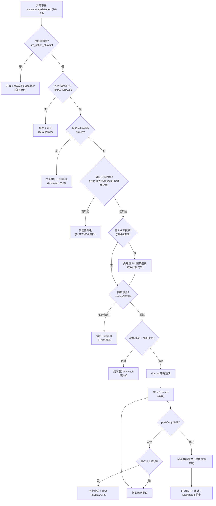
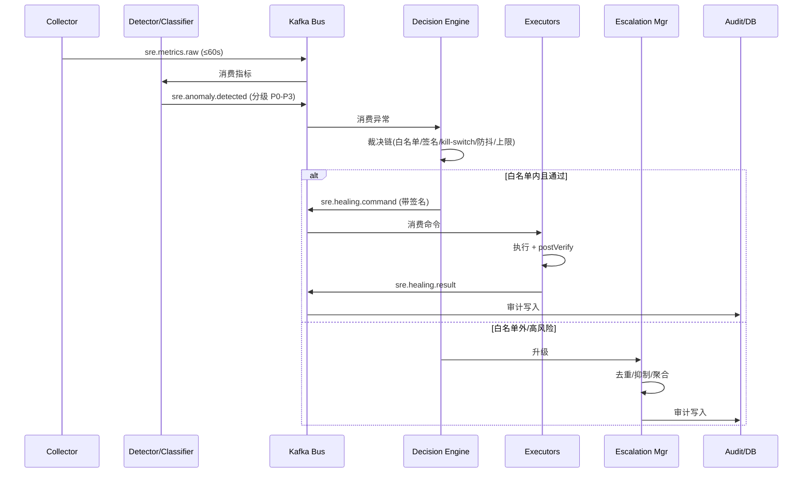

# AI SRE 运维 Agent — 技术架构设计

| 项目 | 内容 |
|------|------|
| 文档编号 | DESIGN-AI-SRE |
| 版本 | v0.1.0 |
| 日期 | 2026-09-05 |
| 关联 Issue | GitHub Issue #370 |
| 上游需求 | FUNCTIONAL-SPEC-AI-SRE v0.2.0（有条件通过，0 Blocking，残余 C1-C6） |
| 作者 | ARCH（架构 Agent） |
| 状态 | Draft（待 DEV/DEVOPS/CHECKER 评审） |

---

## Changelog

| 版本 | 日期 | 变更说明 |
|------|------|----------|
| v0.1.0 | 2026-09-05 | 初稿：基于 FUNCTIONAL-SPEC-AI-SRE v0.2.0，产出总体架构、组件分解、数据流、自愈安全边界、Agent 生态集成、持久化草案、架构图与 ADR；逐条回应 C1-C6 |

---

## 1. 概述与设计目标

### 1.1 定位

AI SRE 是一个**常驻、旁路、全天候值守**的运维 Agent，对 School Admin System 的运行状态进行自主感知，完成异常检测、分级、定位，并对低风险可回滚故障执行受限自愈、对超出边界或高风险的故障进行告警升级。

核心设计原则（承自需求 NFR）：

1. **旁路不侵入**：监控采集对主链路零侵入（< 1% CPU 额外负载），自愈动作全部经门禁且可观测、可追溯。
2. **最小权限 + 白名单 + 签名**：自愈能力是「受限能力」而非「全能 root」，动作白名单带显式授权与签名校验，受全局 kill-switch 与每日上限约束。
3. **可回滚、幂等、可观测**：每个自愈动作幂等、执行前留快照、执行后可回滚，审计日志完整。
4. **复用优先**：监控/事件/审计基础设施优先复用现有 13 容器栈（Prometheus/Kafka/PostgreSQL/Redis/OPA），不引入高成本新组件。

### 1.2 对残余条件 C1-C6 的架构回应（速览）

> 详细设计见 §3/§4/§5/§6/§7/§8，本节为结论索引。

| 编号 | 残余条件 | 架构落位 |
|------|----------|----------|
| **C1** | 安全：白名单+签名、紧急 kill-switch、每日异常动作上限 | §5.1 签名白名单；§5.3 全局 kill-switch（Redis flag + 落盘备份）；§5.4 每日/小时熔断上限 |
| **C2** | AC 覆盖：F-005 五类自愈动作各自可测 | §3.5 五类 Executor 独立抽象 + dry-run 干跑模式 + 独立可观测指标，为 QA 逐类注入故障提供契约 |
| **C3** | 防抖：次数/小时上限 + no-flap/冷却 | §5.4 防抖/熔断器：冷却期、no-flap 检测、单服务次数/小时上限 |
| **C4** | 回滚：回滚后校验配置/依赖一致性 | §5.5 回滚执行器含 Post-rollback Consistency Verifier（配置 hash + 依赖 + migration 一致性校验） |
| **C5** | 判据：Redis「数据损坏」具体判据 | §5.6 Redis 数据损坏检测器：5 类具体信号 + 「非损坏可重启」安全边界 |
| **C6** | Minor：升级去重/抑制、AI SRE 自身运维归属 | §3.6 告警去重/抑制/聚合；§6.4 AI SRE 自身运维归属 |

---

## 2. 总体架构

### 2.1 运行时选型结论

AI SRE **不**复用现有 PM 会话运行时（`agent:main:main`）作为常驻主体，而是：

- **核心运行时 = 独立常驻服务 `ai-sre-service`**（本地进程/容器，规则+策略引擎驱动，7x24 低延迟，不依赖 LLM 即可完成采集/检测/分级/受限自愈）。
- **协作层 = 复用现有 Agent 生态**（write_message.py / agent-status / GitHub label / Dashboard / PM 调度），AI SRE 注册为第 9 个 Agent 角色。
- **深度推理 = 按需云端 LLM**（复杂根因定位、告警文案生成走 OpenClaw gateway 云端模型，符合 HYBRID-ARCHITECTURE「本地流程编排 + 云端深度推理」分层）。

> 该取舍的完整论证见文末 **ADR-001**。

### 2.2 与现有系统的拓扑关系

```
                          ┌───────────────────────────────────────────────┐
                          │            用户 / 外部访问 (Coze proxy)        │
                          └───────────────┬───────────────────────────────┘
                                          │ :5001 gateway / cloudflared
        ┌─────────────────────────────────┼───────────────────────────────┐
        │         三个前端入口             │                               │
        │  admin-app :8080   portal-app :8081   (backend API :3000)       │
        └───────────┬─────────────────────┴──────────────┬────────────────┘
                    │                                     │
              ┌─────▼─────┐                        ┌──────▼─────┐
              │  backend  │◄───────读写───────────►│ PostgreSQL │
              │  :3000    │                        │   :5432    │
              └─────┬─────┘                        └──────┬─────┘
                    │ 缓存                                │ 只读(监控)
              ┌─────▼─────┐                        ┌──────▼─────┐
              │   Redis   │                        │    OPA     │ (ABAC 策略)
              │   :6379   │                        │   :8181    │
              └───────────┘                        └────────────┘

   ┌─────────────────────────────────────────────────────────────────────┐
   │            现有监控/事件基础设施（13 容器 infra 栈）                  │
   │  prometheus(:9091) node_exporter(:9100) postgres_exporter(:9187)    │
   │  alertmanager(:9093)  grafana(:3001)  kafka(:9092) zookeeper(:2181) │
   └───────────────┬─────────────────────────────────────────────────────┘
                   │ 指标 / 事件
   ┌───────────────▼─────────────────────────────────────────────────────┐
   │                     AI SRE 独立服务 (ai-sre-service)                  │
   │   采集 → 检测/分级 → 定位 → 自愈决策 → 执行/升级 → 审计              │
   │   策略引擎(白名单/签名/熔断) · 告警升级 · 审计 · Dashboard 同步       │
   └───────┬─────────────────────────────┬───────────────────────────────┘
           │ 受限自愈(白名单内)           │ 升级(白名单外/高风险)
           ▼                               ▼
   ┌───────────────┐              ┌─────────────────────────────────────┐
   │ 目标服务       │              │ 多 Agent 协作层 (write_message.py)  │
   │ restart/清理等 │              │ PM / DEV / QA / DEVOPS / CHECKER    │
   └───────────────┘              │ / OPS / ARCH / REQ  →  + AI SRE      │
                                  └─────────────────────────────────────┘
```

### 2.3 组件清单

| 组件 | 职责 | 部署形态 |
|------|------|----------|
| **SRE Collector（监控采集）** | 周期采集健康/容器/DB/Redis/磁盘/日志/心跳指标 | ai-sre-service 内常驻循环 |
| **Detector + Classifier（检测/分级）** | 规则+基线检测异常，映射 P0-P3 并给分级理由 | 同上 |
| **Localizer（根因定位）** | 产出受影响组件、最近变更关联、根因假设 | 规则定位（本地）+ 复杂场景云端 LLM |
| **Healing Decision Engine（自愈决策）** | 白名单/签名/kill-switch/熔断/防抖/SVA 门禁裁决 | 策略引擎（可复用 OPA 或独立策略层） |
| **Healing Executors（自愈执行器×5）** | restart 容器/清磁盘/回滚/释放资源/重启 Redis，含执行后验证 | 独立执行器模块，dry-run 可测 |
| **Escalation Manager（告警升级）** | 去重/抑制/聚合，路由 PM/DEVOPS/DEV/QA，创建/关联 Issue | 同上 |
| **Audit Logger（审计日志）** | 不可变审计记录，CHECKER 质检数据源 | 写 PostgreSQL |
| **SRE Dashboard 集成** | agent-status 同步 + 运行状态看板 | 复用 Multi-Agent Dashboard + Grafana |
| **LLM Adapter（深度推理）** | 复杂根因定位/告警文案按需云端 | gateway 云端模型调用 |

---

## 3. 组件分解

### 3.1 SRE Collector（监控采集）

对应 F-SRE-001。采集源与复用情况：

| 采集项 | 数据源 | 采集方式 | 复用 |
|--------|--------|----------|------|
| Backend 健康 | :3000/api/health | HTTP 探针（状态码/时延/body） | 自建探针 |
| 前端可用性 | :8080 / :8081 | HTTP 探针 + 关键页面渲染 | 自建探针 |
| Docker 容器 | docker daemon | `docker ps`/stats/事件流 | 复用 node_exporter/cAdvisor 指标 |
| 数据库 | PostgreSQL | 只读连接（无写权限）`pg_isready`/`pg_stat_activity` | 复用 postgres_exporter |
| Redis | Redis | `redis-cli info/ping` | 自建轻探针 |
| 磁盘 | 宿主/数据卷 | `df`/du | 复用 node_exporter |
| 日志 | 聚合日志流 | tail/订阅 ERROR/FATAL | 复用 kafka 日志主题 |
| 心跳 | Agent 心跳 | agent-status.json / 心跳文件 | 复用现有心跳机制 |

采集节奏：关键健康检查 ≤ 60s，全量巡检 ≤ 5min（NFR-A）。采集器为无状态、可水平扩展的 worker 池，采集结果写入事件总线。

### 3.2 Detector + Classifier（检测与分级）

对应 F-SRE-002/003。采用**规则 + 基线**双通道：

- **规则通道**：硬阈值（磁盘 85%=P2、95%/写满=P0；连接池 >80% 告警等）、状态机（健康检查连续 N 次失败 → P0）。
- **基线通道**：对比历史基线检测突变（错误率/5xx 比例升高、慢查询突增、内存持续高位）。

分级器输出 `{severity P0-P3, 分级理由, 受影响组件, 指标值, 检测时间}`，分级理由为可解释文本（供审计/复盘）。

### 3.3 根因定位（Localizer）

对应 F-SRE-004。分层定位：

1. **确定性定位（本地规则）**：容器 OOM 退出、磁盘写满、端口无响应、依赖不可达 → 直接匹配已知模式，产出根因假设与置信度。
2. **变更关联**：关联最近部署 commit、配置变更（读取部署快照表/变更日志）。
3. **深度定位（云端 LLM）**：低置信度/复杂堆栈 → 通过 LLM Adapter 调云端模型，产出根因假设 + 建议处理动作（自愈 or 升级）。

输出 `{affected_component, recent_changes[], root_cause_hypothesis[], confidence, suggested_action}`。

### 3.4 Healing Decision Engine（自愈决策引擎）

对应 F-SRE-005/006/007 + C1/C3。**自愈执行的唯一裁决入口**，串行执行以下裁决链（任一不通过即转升级）：

```
裁决链：白名单命中 → 签名校验 → 全局 kill-switch 通过 → 分级/风险门禁
       → 防抖(no-flap/冷却/次数上限) → 每日/小时熔断上限 → SVA 门禁映射
       → 干跑(dry-run)预演 → 执行 → 执行后验证
```

### 3.5 Healing Executors（自愈执行器 ×5）

对应 F-SRE-005 + C2。每类动作独立 Executor，统一契约：

```
interface Executor {
  actionType: 'container_restart' | 'disk_cleanup' | 'deploy_rollback'
            | 'resource_release' | 'redis_restart';
  preCheck(ctx): boolean;        // 前置条件校验（白名单/信号确认）
  dryRun(ctx): Plan;             // 干跑预演，返回可执行计划（可测性）
  execute(ctx): Result;          // 幂等执行
  postVerify(ctx): VerifyResult; // 执行后验证（健康/一致性）
}
```

| Executor | 允许自动执行条件（摘要，详见判定矩阵） | 执行后验证 |
|----------|--------------------------------------|-----------|
| container_restart | 无状态服务；二次独立信号确认；冷却期内无重复 | 健康检查恢复 |
| disk_cleanup | 85%≤使用率<95%；仅白名单临时文件/旧日志/孤儿镜像卷 | 磁盘使用率回落 + 受保护卷未动 |
| deploy_rollback | 同时满足 (a)上一稳定版本曾通过 QA 且健康 (b)变更窗内 (c)PM 软授权或严格门禁 | **Post-rollback 一致性校验（C4）** + 健康恢复 |
| resource_release | 僵尸进程/无状态连接池；无在途写；非联动故障 | 资源释放 + 服务健康 |
| redis_restart | 仅缓存/会话；确认非持久队列源；非数据损坏 | ping 恢复 + 数据损坏复核 |

**C2 落位**：五类 Executor 各自独立实现 + 独立 dry-run + 独立指标（`sre_healing_{actionType}_success/failure/latency`），QA 可对每类单独注入故障（杀容器/写满磁盘/坏版本/僵尸进程/Redis 抖动）逐类验收，为后续补足「每类动作各 1 条 AC」提供接口契约。

### 3.6 Escalation Manager（告警升级）

对应 F-SRE-007 + C6。职责：

- **去重**：按异常指纹 `hash(anomaly_type + affected_component + 时间桶)` 去重。
- **抑制**：维护窗口/已知故障静默期内抑制。
- **聚合/收敛**：按 P0/P1 收敛通知（同一根因的多次告警合并为 1 条升级），防告警疲劳与重复 Issue。
- **路由**：PM（P0/P1/需决策）、DEVOPS（部署/回滚/基础设施）、DEV（明确代码缺陷→创建 Issue）、QA（自愈后验证请求）。
- **可靠性**：升级链路失败 → 落盘持久化重试（Kafka 消费重试 + 保底落地 Issue）。

### 3.7 Audit Logger（审计日志）

对应 NFR-S/F-SRE-010。不可变、完整记录执行者/时间/动作/结果，是 CHECKER 质检的输入。写入失败则**阻止后续自愈**（fail-closed，UC-010）。

---

## 4. 数据流与事件通道

### 4.1 事件通道选型

**结论：复用现有 Kafka（confluent 7.4.0，:9092）作为主事件总线**；Redis Streams 作为轻量降级备选（Kafka 单机不可用时自动降级，保证告警不丢失）。该取舍见 **ADR-002**。

Kafka Topic 规划（新增，复用现有 kafka 容器）：

| Topic | 生产者 | 消费者 | 语义 |
|-------|--------|--------|------|
| `sre.metrics.raw` | Collector | Detector | 原始采集快照 |
| `sre.anomaly.detected` | Detector | Localizer / Decision Engine | 已分级异常事件 |
| `sre.healing.command` | Decision Engine | Executors | 已裁决的自愈命令（含签名） |
| `sre.healing.result` | Executors | Decision Engine / Audit | 执行结果（含验证） |
| `sre.escalation.request` | Escalation Manager | 外部协作层 | 升级请求（去重后） |

### 4.2 完整数据流链路

```
  [监控数据]  →  [检测]  →  [分级]  →  [自愈 / 升级]  →  [审计]
      │             │          │           │               │
 Collector     Detector   Classifier   Decision Engine  Audit Logger
   (探针)      (规则+基线)  (P0-P3)     (白名单+签名+     (不可变)
      │             │          │        熔断+防抖+门禁)     │
      ▼             ▼          ▼           ▼               ▼
 sre.metrics.raw  sre.anomaly.detected   sre.healing.command ──► 写入
  (Kafka)        (Kafka)    │            sre.healing.result    PostgreSQL
                            │            (Kafka)
                            │                 │
                            │          ┌──────┴───────┐
                            │          ▼              ▼
                            │    [白名单内+通过]  [白名单外/高风险]
                            │          │              │
                            │       Executors    Escalation Manager
                            │      (5类+验证)     (去重/抑制/聚合)
                            │          │              │
                            │          ▼              ▼
                            │     自愈成功记录    升级 PM/DEVOPS/DEV/QA
                            │          │         (write_message + Issue)
                            │          ▼              │
                            │    postVerify 失败→转升级
                            ▼
                      sre.escalation.request (Kafka)
```

---

## 5. 自愈执行安全边界

> 本章回应 **C1（安全）、C3（防抖）、C4（回滚）、C5（判据）**，并与 SVA gate 对齐。

### 5.1 动作白名单 + 签名校验（C1）

- **白名单**：所有可自动执行动作维护在版本化策略表 `sre_action_allowlist`（§7.2），每条含：`action_type / target_pattern（如 service 名称正则）/ allowed / 前置条件 / daily_limit / hourly_limit / cooldown_seconds / requires_signature / requires_pm_auth / schema_version`。
- **签名**：自愈命令由 Decision Engine 签发，携带 `HMAC-SHA256(action_payload, sre_signing_key)` 签名；Executor 验签通过才执行。签名密钥与业务凭据分离，通过密钥管理（Vault/环境注入）获取，不落盘明文。
- **凭证分离**：AI SRE 运行账户为独立受限账户（非 root），仅持监控只读 + 白名单内动作所需的最小 Docker/命令权限，**不持有 PostgreSQL 写权限、不访问 PII**。

### 5.2 与 SVA gate 的关系（哪些免门禁、哪些需 PM 软授权）

AI SRE 的自愈动作属新增 Action Class `SRE_HEAL`，映射关系：

| 自愈动作 | SVA 门禁 | 说明 |
|----------|----------|------|
| 重启容器（无状态） | 免门禁（白名单+签名+限流自动放行） | 低风险可回滚，等价 OPS「AUDIT 级」日常操作 |
| 清理磁盘（白名单内） | 免门禁 | 仅白名单临时文件/旧日志，不触碰受保护卷 |
| 连接池重建/释放资源 | 免门禁 | 仅无在途写且确认非联动 |
| 重启 Redis（仅缓存/会话、非损坏） | 免门禁 | 受数据损坏检测硬约束 |
| **回滚部署** | **需 PM 软授权**（或严格门禁） | 触及发布/变更窗治理，须先 upgrade PM 获授权 |

> 所有「免门禁」动作仍必须通过 §5.1 白名单+签名+§5.3 kill-switch+§5.4 熔断/防抖；「免门禁」仅指**不需人工逐次审批**，非「无任何控制」。

### 5.3 全局紧急 kill-switch（C1）

- 单一全局熔断开关：`sre:kill_switch`（Redis flag，值 `armed`/`disarmed`），同时落盘备份到 PostgreSQL 审计记录。
- 任一人（PM/CHECKER/人类）可一键置 `armed`；置位后：**所有自愈动作（含已在队列中的命令）立即中止**，Executor 拒绝执行并转升级。
- 自愈风暴、安全事件、大促/变更冻结期等场景强制置位。恢复需人工显式 `disarmed` 并记录审计。

### 5.4 熔断/退避/每日上限（C1/C3）

三层限流，全部在 Decision Engine 内以 Redis 计数器实现（默认值可配）：

| 维度 | 默认值 | 超限动作 |
|------|--------|----------|
| 单服务自愈次数/小时 | 5 次/小时 | 熔断该服务，转升级 DEVOPS |
| 全局自愈次数/日 | 50 次/日 | 全局熔断，置 kill-switch，转升级 PM |
| 单动作冷却期 | restart 10min / 回滚 30min / 清盘 60min | 冷却期内拒绝重复 |

**防抖（no-flap）**：同一异常指纹在时间窗内反复「恢复→再告警」达 N 次（默认 3 次/30min）→ 判定 flap，停止自愈并转升级人工研判（防止对健康服务误伤/自愈风暴）。

**退避**：自愈失败重试采用指数退避（1→2→4min），达上限（默认 3 次）停止重试转升级（UC-008）。

### 5.5 回滚后一致性校验（C4）

回滚执行器 `postVerify` 强制包含 **Post-rollback Consistency Verifier**，在「验证健康恢复」之外额外校验：

1. **配置一致性**：对比版本快照的 env/config hash，检测配置漂移。
2. **依赖一致性**：依赖服务健康、DB migration 版本匹配、Redis key schema 兼容。
3. **版本一致性**：确认回滚目标命中「最近一次 QA 签收通过」的版本集（快照含 QA 签收标记）。

任一校验失败 → 立即升级 DEVOPS，标注**紧急**，不自动二次回滚。

### 5.6 Redis「数据损坏」具体判据（C5）

`redis_restart` Executor 前置必须通过 Redis Data Corruption Detector，出现**任一**信号即判定「数据损坏」，**禁止重启**（避免丢失/放大），转升级 DEVOPS：

1. AOF/RDB 加载失败，或 `redis-cli info persistence` 报 `rdb_last_bgsave_status=err` / `aof_last_write_status=err`。
2. `redis-check-rdb` / `redis-check-aof` 校验失败。
3. 关键 key 类型不匹配（对预期类型做 `TYPE` 抽样，如预期 string 实为 hash/list）。
4. 持久队列数据源 key 的应用层 CRC/签名校验失败。
5. 主从复制 offset 持续倒退/不一致且无法自愈。

**「非损坏可重启」安全边界**（同时满足才可重启）：Redis 仅作缓存/会话（配置白名单 key 前缀 + 无持久队列 key 前缀）且 `rdb_last_bgsave_status=ok` 且无上述 5 类信号。

---

## 6. 与现有 Agent 生态集成（C6/F-SRE-009）

### 6.1 注册清单（落地项）

AI SRE（及 OPS，若需）需注册进以下位置（现有枚举为 `{PM,DEV,QA,DEVOPS,CHECKER,ARCH,REQ}`）：

| 位置 | 现状 | 需变更 |
|------|------|--------|
| `skills/agent-communication/scripts/write_message.py` | `GITHUB_AGENT_LABELS` + `--from` choices 无 AI SRE | 新增 `"AI-SRE": "ai-sre"`（含 label 映射与 `--from` 枚举） |
| `agent-status.json` | 无 AI SRE | 由 write_message 自动写入 |
| GitHub label | 无 `ai-sre` | 新增 label `ai-sre` |
| Dashboard 面板 | 无 AI SRE | update_dashboard 渲染新角色卡 |
| `docs/SVA-GATE.md` | 无 AI SRE 角色 | 新增 §3.5 AI SRE Role-Action 矩阵（含 `SRE_HEAL` 动作类） |

> 说明：ARCH 只输出**变更清单**，具体枚举/标签/面板落地由 DEVOPS/PM 在实施阶段执行（属代码/配置变更，超出 ARCH 职责）。

### 6.2 通信协议

AI SRE 通过 write_message.py 收发消息，遵循现有 `--from/--to/--type/--status` 语义，与 F-SRE-008 协作接口对齐（见 §5 协作路由）。

### 6.3 心跳与自身可用性兜底

- AI SRE 每 5min 写一次自身心跳（复用 agent-status.json）。
- **PM watchdog 兜底**：PM 侧检测 AI SRE 心跳超时 → 告警（UC-009）。
- **对等健康对账（补 m5 兜底环）**：OPS 基础巡检作为 AI SRE 的独立第二观察者，交叉核对 AI SRE 是否在线，形成「PM watchdog + OPS 对等对账」双兜底。

### 6.4 AI SRE 自身运维归属（C6-m7）

| 事项 | 归属 |
|------|------|
| AI SRE 运行时部署/升级/回滚 | **DEVOPS**（超出 AI SRE 自愈权限，自身不回滚自己） |
| AI SRE 代码/配置变更 review | **PM 审批 + CHECKER 质检** |
| 自愈策略/白名单变更 | **PM 软授权**，变更走审计 |
| AI SRE 自身故障修复 | 心跳兜底检测 → **DEVOPS** |
| 纯运营值班/巡检 | **OPS**（与 DEVOPS 命名区分） |

---

## 7. 持久化与状态

### 7.1 存储选型

- **状态/历史/审计 → PostgreSQL**（新增 `sre_*` 表 + 复用既有 `audit_logs` 扩展枚举）。
- **限流/熔断/防抖计数器 → Redis**（高频、短生命周期，无需持久化，宕机可重置）。
- **事件流 → Kafka**（§4 主题，retention 72h）。

### 7.2 新增表字段草案

> 命名遵循 DB-SCHEMA §2 命名规范（snake_case，TIMESTAMPTZ，ENUM）。审计事件**复用既有 `audit_logs`**（扩展 `audit_action` 枚举），不重复建表。

**表 1：`sre_incidents` — 异常事件（检测/分级/定位的真相源）**

| 字段 | 类型 | 说明 |
|------|------|------|
| id | UUID PK | 事件主键 |
| anomaly_type | VARCHAR(64) | 异常类型（service_down/disk_high/db_error/redis_error/...） |
| severity | sre_severity_enum | P0/P1/P2/P3 |
| status | sre_incident_status_enum | detected/locating/healing/escalated/resolved/suppressed |
| affected_component | VARCHAR(128) | 受影响组件/容器/服务 |
| root_cause_hypotheses | JSONB | 根因假设数组（含置信度） |
| recent_changes | JSONB | 最近部署 commit/配置变更关联 |
| dedup_fingerprint | VARCHAR(64) | 去重指纹 hash |
| detected_at | TIMESTAMPTZ | 检测时间 |
| resolved_at | TIMESTAMPTZ | 解决时间 |
| created_by | VARCHAR(16) | 记录来源（ai-sre） |

**表 2：`sre_healing_actions` — 自愈动作执行记录（C1/C2 审计核心）**

| 字段 | 类型 | 说明 |
|------|------|------|
| id | UUID PK | 动作主键 |
| incident_id | UUID FK→sre_incidents | 关联事件 |
| action_type | sre_action_enum | container_restart/disk_cleanup/deploy_rollback/resource_release/redis_restart |
| target | VARCHAR(128) | 目标（容器/卷/服务名） |
| policy_version | VARCHAR(32) | 白名单策略版本 |
| signature | VARCHAR(128) | HMAC 签名（验签留痕） |
| dry_run_result | JSONB | 干跑计划 |
| result | sre_action_result_enum | success/failed/skipped/killswitched/escalated |
| post_verify_result | JSONB | 执行后验证（含 C4 一致性校验） |
| retry_count | SMALLINT | 重试次数 |
| started_at / finished_at | TIMESTAMPTZ | 起止时间 |
| duration_ms | INTEGER | 执行时长 |

**表 3：`sre_escalations` — 升级记录（C6 去重/抑制留痕）**

| 字段 | 类型 | 说明 |
|------|------|------|
| id | UUID PK | 升级主键 |
| incident_id | UUID FK→sre_incidents | 关联事件 |
| target_agent | VARCHAR(16) | PM/DEVOPS/DEV/QA |
| channel | VARCHAR(32) | write_message / Issue / 其他 |
| issue_id | INTEGER | 关联 GitHub Issue |
| dedup_fingerprint | VARCHAR(64) | 去重/抑制指纹 |
| status | sre_escalation_status_enum | pending/sent/acked/failed |
| payload_ref | VARCHAR(128) | 升级内容引用 |
| sent_at / ack_at | TIMESTAMPTZ | 发送/确认时间 |

**表 4：`sre_action_allowlist` — 自愈白名单与策略（版本化）**

| 字段 | 类型 | 说明 |
|------|------|------|
| id | UUID PK | 策略主键 |
| action_type | sre_action_enum | 动作类型 |
| target_pattern | VARCHAR(128) | 目标匹配模式（service 正则） |
| allowed | BOOLEAN | 是否允许自动执行 |
| preconditions | JSONB | 前置条件（信号确认/用途白名单） |
| daily_limit / hourly_limit | SMALLINT | 每日/小时上限（C1/C3） |
| cooldown_seconds | INTEGER | 冷却期 |
| requires_signature | BOOLEAN | 是否需签名 |
| requires_pm_auth | BOOLEAN | 是否需 PM 软授权（回滚=true） |
| schema_version | VARCHAR(32) | 策略版本 |
| updated_by / updated_at | VARCHAR(16)/TIMESTAMPTZ | 变更审计 |

**复用：`audit_logs` 扩展 `audit_action` 枚举**（追加值）：
`sre_incident_detected, sre_healing_executed, sre_escalated, sre_killswitch_toggled, sre_policy_changed, sre_rollback_executed`

---

## 8. 架构图

### 8.1 总体拓扑图

```mermaid
flowchart TB
    subgraph Users["外部访问"]
        U["用户 / Coze proxy"]
    end

    subgraph Front["前端入口"]
        ADMIN["admin-app :8080"]
        PORTAL["portal-app :8081"]
    end

    subgraph App["应用与数据层"]
        BACKEND["backend :3000 (NestJS)"]
        PG[("PostgreSQL :5432")]
        REDIS[("Redis :6379")]
        OPA["OPA :8181 (ABAC)"]
    end

    subgraph Infra["现有监控/事件基础设施 (13 容器)"]
        PROM["prometheus :9091"]
        NEXP["node_exporter :9100"]
        PGEXP["postgres_exporter :9187"]
        AM["alertmanager :9093"]
        GRAF["grafana :3001"]
        KAFKA["kafka :9092"]
    end

    subgraph SRE["AI SRE 独立服务 (ai-sre-service)"]
        direction TB
        COL["Collector 采集"]
        DET["Detector/Classifier 检测分级"]
        LOC["Localizer 定位"]
        DEC["Healing Decision Engine 决策"]
        EXE["Healing Executors ×5 执行"]
        ESC["Escalation Manager 升级"]
        AUD["Audit Logger 审计"]
        COL --> DET --> LOC --> DEC
        DEC -->|白名单内| EXE
        DEC -->|白名单外/高风险| ESC
        EXE --> AUD
        ESC --> AUD
    end

    subgraph Agents["多 Agent 协作层 (write_message.py)"]
        PM["PM"]
        DEV["DEV"]
        QA["QA"]
        DEVOPS["DEVOPS"]
        CHECKER["CHECKER"]
        OPS["OPS"]
    end

    U --> ADMIN
    U --> PORTAL
    ADMIN --> BACKEND
    PORTAL --> BACKEND
    BACKEND --> PG
    BACKEND --> REDIS
    BACKEND --> OPA

    BACKEND -->|健康探针| COL
    PG -->|只读监控| COL
    REDIS -->|只读监控| COL
    PROM --> COL
    KAFKA <-->|事件总线| SRE
    COL -->|sre.metrics.raw| KAFKA
    KAFKA -->|sre.anomaly.detected| DET
    EXE -->|sre.healing.result| KAFKA
    ESC -->|sre.escalation.request| KAFKA

    EXE -->|restart/清理(白名单)| BACKEND
    EXE -->|受限| REDIS

    AUD --> PG
    ESC -->|升级| PM
    ESC -->|升级| DEVOPS
    ESC -->|Issue| DEV
    ESC -->|验证请求| QA
    AUD -->|质检| CHECKER

    GRAF -->|SRE 看板| PM
    AM -->|告警| ESC
```

### 8.2 自愈决策流程图



### 8.3 事件总线数据流图



---

## 9. 部署与运行拓扑（变更增量）

- **新增 1 个容器**：`school-admin-ai-sre`（`ai-sre-service`），加入 `school-network`，只读访问 postgres/redis/kafka，白名单内动作经受限账户执行 docker 命令。
- **复用**：kafka（新增 5 个 topic）、postgres（新增 4 张表 + audit_logs 枚举）、redis（限流计数器 + kill-switch）、prometheus/grafana（SRE 指标 + 看板）。
- **凭证**：AI SRE 签名密钥、受限账户凭证经密钥管理注入，不落盘明文。
- **升级影响**：仅新增旁路服务，不动 backend/admin/portal 主链路，满足 NFR-A「单点故障不影响业务」。

---

## 10. 非功能需求映射

| NFR | 架构落位 |
|-----|----------|
| A 可用性 | 独立旁路服务 + PM watchdog + OPS 对等对账双兜底 |
| R 可靠性 | Executor 幂等 + 快照留存 + Kafka 持久化重试 |
| S 安全性 | §6 白名单+签名+kill-switch+熔断+凭证分离+最小权限 |
| P 性能 | 采集 <1% 负载；检测→告警 ≤2min；单动作 ≤60s 超时转升级 |
| O 可观测 | sre_* 指标 + 审计 + Grafana 看板 + 历史趋势 |
| C 成本 | 复用现有监控/事件/存储栈，仅新增 1 容器 |

---

## 11. 风险与对策

| 风险 | 对策 |
|------|------|
| AI SRE 被攻陷 → 武器化自愈 | 白名单+签名+kill-switch+每日上限+凭证分离（C1） |
| 自愈风暴/误伤健康服务 | no-flap + 冷却期 + 次数/小时上限（C3） |
| 回滚到坏版本/配置漂移 | 回滚目标命中 QA 签收版本集 + post-rollback 一致性校验（C4） |
| Redis 重启导致数据丢失 | 数据损坏 5 判据硬约束，损坏即禁重启（C5） |
| 告警疲劳/重复 Issue | 升级去重/抑制/聚合（C6） |
| AI SRE 自身单点故障 | PM watchdog + OPS 对等对账，DEVOPS 负责修复（C6-m7） |
| 监控数据无限增长 | 保留周期可配 + 复用 Kafka 72h retention |

---

## 架构决策记录 (ADR)

### ADR-001：AI SRE 运行时采用「独立常驻服务 + 复用 Agent 生态协作层」

- **背景**：AI SRE 需 7x24 全天候、≤60s 采集、≤2min 检测到告警、旁路不侵入。若完全复用 PM 会话运行时（`agent:main:main`），会引入 LLM 推理延迟、Token 成本、且监控/自愈逻辑与 PM 调度耦合；若完全独立成系统，则无法融入现有多 Agent 协作（Issue 为唯一真相源、Dashboard、write_message）。
- **决策**：核心运行时为独立常驻 `ai-sre-service`（规则+策略引擎驱动，确定性逻辑不依赖 LLM），协作层复用 write_message.py/agent-status/GitHub label/Dashboard 并注册为第 9 个 Agent，复杂根因定位按需云端 LLM。
- **理由**：符合 HYBRID-ARCHITECTURE「本地流程编排 0 成本 0 延迟 + 云端深度推理按需付费」分层；监控/自愈是高频确定性任务走本地，根因定位/告警文案是低频深度任务走云端。
- **影响**：新增 1 个容器与受限运行账户；需将 AI SRE 注册进 Agent 生态（§6）；后续 DEV/DEVOPS 需实现 `ai-sre-service` 本体。

### ADR-002：事件通道复用 Kafka（降级备选 Redis Streams）

- **背景**：监控→检测→分级→自愈/升级→审计需要可靠的异步事件通道，且 NFR-C 要求复用现有基础设施。
- **决策**：主通道复用现有 kafka 容器（:9092），新增 5 个 `sre.*` topic；Redis Streams 作为 Kafka 单机不可用时的轻量降级备选。
- **理由**：Kafka 已在 13 容器栈中运行，支持持久化/重试/消费组，满足「告警不丢失 + 升级失败重试」；避免引入新消息中间件成本。
- **影响**：需在 kafka 上建 topic 与配置 retention；需实现 Kafka↔Redis Streams 的降级切换逻辑（或先仅用 Kafka，降级方案作为演进项）。

### ADR-003：自愈权限模型采用「分层授权：策略引擎自动放行低风险 + PM 软授权高风险 + 全局 kill-switch」

- **背景**：自愈能力是双刃剑——既要自动化简单故障恢复，又要防止被攻陷后放大攻击、以及误伤生产。需求要求「哪些免门禁、哪些需 PM 软授权」明确治理。
- **决策**：新增 Action Class `SRE_HEAL` 并入 SVA gate；低风险动作（重启无状态容器/清白名单磁盘/连接池重建/非损坏 Redis 重启）经白名单+签名+限流由策略引擎自动放行（免逐次审批）；回滚部署必须 PM 软授权或严格门禁；全局 kill-switch 可一键冻结全部自愈。
- **理由**：在「自动化收益」与「安全可控」间取得平衡；高风险操作（回滚触及发布/变更窗治理）保留人工裁决，低风险操作无需人工即可快速恢复，减少 MTTR。
- **影响**：需扩展 docs/SVA-GATE.md 增加 AI SRE Role-Action 矩阵；需实现策略引擎 + kill-switch + 签名体系（§6）。

---

*本文档为架构设计，不包含业务代码实现。技术选型落地、`ai-sre-service` 实现、SVA-GATE/Agent 生态注册由 DEV/DEVOPS 在评审通过后执行。*
