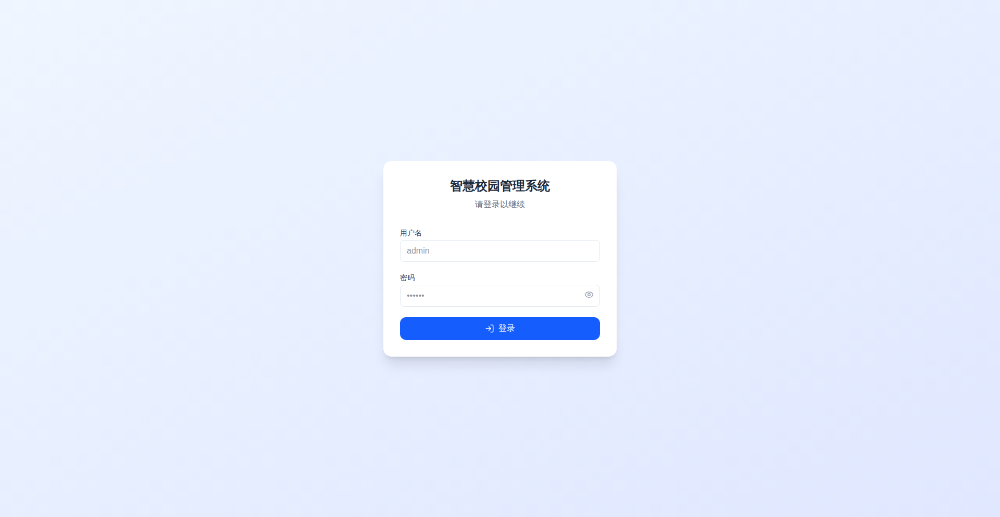

# 通知管理模块测试报告

**测试日期**: 2026-06-12
**测试环境**: https://9304af57f99f1622-101-126-131-121.serveousercontent.com/
**测试模块**: 通知管理 (NotificationPage)
**测试人员**: QA Agent

## 执行摘要

### 测试状态
⚠️ **测试受阻** - 需要身份验证

### 问题描述
测试环境需要登录才能访问通知管理模块。当前页面显示为"智慧校园管理系统"登录页面，无法直接访问通知管理功能。

### 测试环境截图

## 测试清单执行情况

### 1. 页面加载 ❌ 无法测试
- [ ] 通知列表显示 - **受阻**: 需要登录
- [ ] 筛选区域显示 - **受阻**: 需要登录
- [ ] 新建通知按钮显示 - **受阻**: 需要登录

### 2. 通知类型 ❌ 无法测试
- [ ] 系统通知 - **受阻**: 需要登录
- [ ] 个人通知 - **受阻**: 需要登录
- [ ] 群组通知 - **受阻**: 需要登录

### 3. 筛选功能 ❌ 无法测试
- [ ] 按通知类型筛选 - **受阻**: 需要登录
- [ ] 按已读/未读筛选 - **受阻**: 需要登录
- [ ] 按时间范围筛选 - **受阻**: 需要登录
- [ ] 组合筛选 - **受阻**: 需要登录

### 4. 搜索功能 ❌ 无法测试
- [ ] 按标题搜索 - **受阻**: 需要登录
- [ ] 按内容搜索 - **受阻**: 需要登录
- [ ] 清空搜索 - **受阻**: 需要登录

### 5. 标记功能 ❌ 无法测试
- [ ] 标记为已读 - **受阻**: 需要登录
- [ ] 标记为未读 - **受阻**: 需要登录
- [ ] 全部标记已读 - **受阻**: 需要登录

### 6. 删除功能 ❌ 无法测试
- [ ] 单条删除 - **受阻**: 需要登录
- [ ] 批量删除 - **受阻**: 需要登录
- [ ] 确认弹窗 - **受阻**: 需要登录

### 7. 新建通知 ❌ 无法测试
- [ ] 创建系统通知 - **受阻**: 需要登录
- [ ] 发送给指定用户 - **受阻**: 需要登录
- [ ] 发送给群组 - **受阻**: 需要登录

### 8. 通知详情 ❌ 无法测试
- [ ] 查看通知详情 - **受阻**: 需要登录
- [ ] 显示通知内容 - **受阻**: 需要登录
- [ ] 关闭详情 - **受阻**: 需要登录

### 9. 刷新功能 ❌ 无法测试
- [ ] 手动刷新列表 - **受阻**: 需要登录
- [ ] 自动刷新 - **受阻**: 需要登录

### 10. 错误处理 ❌ 无法测试
- [ ] 网络错误提示 - **受阻**: 需要登录
- [ ] API错误处理 - **受阻**: 需要登录

## 遇到的问题

### 问题 #1: 身份验证要求
- **严重程度**: 🔴 阻断性
- **描述**: 通知管理模块需要登录才能访问，自动化测试无法绕过身份验证
- **影响**: 所有测试用例无法执行
- **建议**:
  1. 提供测试账号的登录凭据，以便自动化测试可以完成登录流程
  2. 或提供无需登录的测试环境（开发/测试环境）
  3. 或提供已保存的浏览器会话状态（包含登录信息）

## 后续步骤

### 需要PM确认
1. 是否提供测试账号登录凭据？
2. 是否有免登录的测试环境？
3. 是否接受手动登录后继续自动化测试？

### 建议方案
**方案A**: 提供测试账号，自动化完成登录流程
- 需要信息: 用户名、密码、登录URL
- 优点: 完全自动化
- 缺点: 需要维护测试账号

**方案B**: 提供免登录测试环境
- 需要信息: 免登录访问URL或跳过认证的测试环境
- 优点: 测试速度快，无需登录步骤
- 缺点: 可能无法完全模拟生产环境

**方案C**: 手动登录 + 自动化继续
- 操作: PM手动登录后，QA Agent继续执行测试
- 优点: 简单快速
- 缺点: 半自动化，不适合持续集成

## 测试统计

- **总测试项**: 10个大类
- **可执行**: 0
- **受阻**: 10
- **通过**: 0
- **失败**: 0
- **完成率**: 0%

## 附录

### 测试环境信息
- 浏览器: Chrome (Headless/Headed 混合模式)
- 测试URL: https://9304af57f99f1622-101-126-131-121.serveousercontent.com/
- 测试日期: 2026-06-12
- 会话ID: nova-fjord

### 浏览器会话状态
- 浏览器进程仍运行中（保持登录会话以备后续测试）
- 如需查看浏览器预览，请访问提供的VNC链接

---
**报告生成时间**: 2026-06-12
**QA Agent**: 自动化测试系统